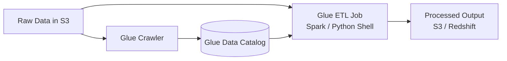
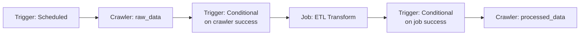

# AWS Glue — Study Notes (DEA-C01)

> Covers the README's "AWS Glue" section (`README.md` lines 51-229). The hands-on build for this lesson lives in the repo's `2.glue-code/` folder.

---

## 0. Setup recap (brief)

Before the Glue work starts, the repo's base setup (`README.md` lines 1-49) runs a CloudFormation stack (`set-code.yaml`) that creates the shared network and storage foundation: a VPC, two public subnets, security groups, a routing table, and one S3 bucket. This is plumbing, not a DEA-C01 topic in its own right — Glue jobs that reach a VPC resource (RDS, Redshift) later attach to this VPC through a Glue connection. The bucket gets five top-level folders (`rawData`, `processedData`, `scriptLocation`, `tmpDir`, `athena`) that later sections use as source, target, script, temp, and query-result locations. Nothing here is Glue-specific; skip straight to the Glue content below for exam material.

---

## 1. AWS Glue Introduction

AWS Glue is a **serverless data integration service**. "Serverless" here means you never provision or patch a Spark cluster — you submit a job, AWS Glue allocates the compute (measured in DPUs, see §8.3), runs your script, and tears the compute down. You pay only for the time the job actually runs, billed by the second.

**Why this matters for the exam**: Glue is almost always the answer when a question describes ETL/ELT that needs to (a) run on a schedule or event, (b) transform data using Spark or Python, and (c) avoid managing infrastructure. Compare it to the alternatives the exam likes to test against:

| Service | When the exam prefers it over Glue |
|---|---|
| **Amazon EMR** | You need full control of the Spark/Hadoop cluster (custom frameworks, Hive, Presto, HBase), very large/long-running jobs where reserved/spot cluster pricing beats DPU pricing, or you need software Glue doesn't support. EMR = you manage the cluster; Glue = AWS manages it. |
| **AWS Lambda** | The transform is small, stateless, and finishes in under 15 minutes, with no need for a distributed Spark engine or built-in Data Catalog integration. |
| **AWS Glue** | You want managed Spark/Python ETL, native Data Catalog integration, and a pay-per-DPU-second bill with no cluster to manage. |

AWS Glue Studio (visual editor), the script/notebook editors, and AWS Glue DataBrew are all authoring surfaces on top of the same underlying Glue engine and Data Catalog — the README's introduction gestures at this but doesn't distinguish them; §8.5, §11 below do.

---

## 2. AWS Glue Data Catalog

The Data Catalog is a **persistent, managed metadata store** — a Hive-metastore-compatible catalog of databases, tables, and partitions. It stores *only* metadata (schema, location, format, partition keys) — never the data itself. This is the single most important exam fact about the Catalog: dropping a Glue table does not delete the underlying S3 objects, and creating a table does not copy or move data.

**What actually uses it**: Athena, Redshift Spectrum, EMR (Hive/Spark), Glue ETL jobs, and Lake Formation all read from the same Data Catalog. This is why the exam frequently asks "you catalog data once with a crawler — which services can now query it?" — the answer is usually "all of them," because the Catalog is the shared metadata layer across the analytics stack, not a Glue-only artifact.

**Scope**: one Data Catalog per AWS account per Region (unless you deliberately federate/share it cross-account — see §12.3).

**Pricing basics** (verify current rates on the AWS Glue pricing page before quoting them in a design decision): the first 1 million objects stored and first 1 million requests per month are free; beyond that it's roughly $1 per 100,000 objects stored per month. This is why the Catalog is described as "practically free" for small-to-medium data lakes.

---

## 3. Glue Data Catalog Databases

A Glue database is a **logical grouping** of tables — a namespace, not a physical container. It has no storage location of its own and holds no data. Every table belongs to exactly one database. The README's plan to create `raw_data` and `processed_data` databases mirrors a common lakehouse-zoning pattern (raw/bronze vs processed/silver), but the pattern is a convention, not a Glue requirement — Glue is indifferent to how you name or split your databases.

---

## 4. Glue Data Catalog Tables

A Glue table is **metadata only**: a schema (column names/types), a pointer to where the data lives (e.g., an S3 prefix), and format/serde information (CSV, Parquet, JSON, etc.). The README's phrase "the data resides in its original store" is the key idea — a Glue table is a *view definition*, not a copy.

Two ways to create tables:
- **Manually**, through the console/API/CloudFormation, when you already know the exact schema (as the README does for the `customers` table).
- **Via a crawler** (§5), when you want Glue to infer the schema by sampling the actual files.

Tables carry **schema versioning** — the Catalog keeps a history of schema versions as a table evolves, and you can view/compare previous versions. This backs the crawler's schema-change-policy behavior in §5.

---

## 5. AWS Glue Crawler

A crawler connects to a data store (S3, JDBC, DynamoDB, etc.), infers schema by sampling objects, and writes (or updates) tables in the Data Catalog. It is the "primary method" the README describes, and that's accurate — but the README stops at "it creates tables," which undersells what you need to know for the exam.

The diagram below ties together the pieces from §2 (Data Catalog), §4 (Tables), this section (Crawler), and §8 (ETL Job), which the README covers as separate topics without showing how data actually moves through them end to end:

The crawler only ever reads S3 (or another source) to infer schema and write Catalog metadata (§5.4); the ETL job is the piece that actually reads the raw data and writes transformed output, using the Catalog's schema/location metadata to know where to read from.

### 5.1 Classifiers — how schema inference actually works

A crawler doesn't guess blindly; it runs **classifiers** against sample data to determine format and schema:

- **Built-in classifiers** recognize common formats out of the box: CSV, JSON, Avro, ORC, Parquet, XML, Ion, combined Apache log, and a few others.
- **Custom classifiers** you write yourself when built-ins don't fit: **Grok** (regex-based, for arbitrary log/text formats), **XML** (row-tag based), **JSON** (JSON-path based), and **CSV** (custom delimiter/header handling).

Order of evaluation matters and is exam-relevant: **custom classifiers run first**, in the order you list them on the crawler. Each classifier returns a **certainty score**; a score of **1.0** means "I'm certain this is the schema," and the crawler stops and uses that classifier's output immediately — no further classifiers run. If no classifier hits 1.0, Glue falls back to built-in classifiers, and if nothing scores above 0.0, the crawler marks the data `UNKNOWN`.

### 5.2 Exclude patterns

You can give a crawler **exclude patterns** (glob-style paths) so it skips specific prefixes or file types within a data store — useful for skipping temp files, `_SUCCESS` markers, or a subfolder that has an incompatible schema, without needing a second crawler.

### 5.3 Schema change policy — this is a classic exam question

When a crawler re-runs against a source whose schema changed since the last run, two independent settings control the outcome:

**UpdateBehavior** (what to do about a *changed* schema):
| Console label | API value | Effect |
|---|---|---|
| Update the table definition in the data catalog | `UPDATE_IN_DATABASE` | Adds new columns, removes columns no longer present, updates type changes. |
| Add new columns only | (a merge/log-and-add mode) | Adds new columns but never removes or overwrites columns you've since edited manually. |
| Ignore the change and don't update the table | `LOG` | Detects and logs the change but leaves the Catalog table untouched. |

**DeleteBehavior** (what to do when source *objects* — files/partitions — disappear):
| Console label | API value | Effect |
|---|---|---|
| Delete tables and partitions from the Data Catalog | `DELETE_FROM_DATABASE` | Removes the corresponding Catalog entries. |
| Ignore the change and don't update the table | `LOG` | Leaves the Catalog entry in place and only logs that the source object is gone (so a partition can point at data that no longer exists). |
| Mark the table as deprecated in the Data Catalog | `DEPRECATE_IN_DATABASE` | Tags the table `DEPRECATED` with a timestamp instead of deleting it. |

The exam trap: "Add new columns only" + "ignore deletes" is the safe default for a production table that downstream jobs depend on — it prevents a crawler from silently dropping columns or partitions that other processes still reference, at the cost of the Catalog drifting from reality over time (the reason `LOG`/deprecate options exist instead of blind deletion).

### 5.4 Cost and operational notes

- Crawlers are billed the same **$0.44 per DPU-hour** rate as standard Glue jobs (verify current pricing), but with a **10-minute minimum** per run instead of the 1-minute minimum on jobs — a crawler that finishes in 30 seconds still bills 10 minutes.
- Crawlers support **incremental crawls** (crawl only new S3 folders/partitions since the last run) to cut cost and runtime on large, append-only datasets.
- A crawler is not an ETL tool: it only ever reads source data to infer schema and writes catalog metadata. It never transforms or moves the underlying data. If a question describes moving/transforming data, the answer is a Glue *job*, not a crawler.

### 5.5 Alternatives to crawling

You don't have to crawl to get a queryable table:
- **Manual DDL** (e.g., `CREATE EXTERNAL TABLE` in Athena, or a manual Glue table) when the schema is fixed and known — no crawler needed, no crawler cost.
- **Partition projection** (Athena feature, §7) computes partition locations from a naming convention instead of storing them in the Catalog, which removes the need to crawl or repair partitions at all for large, regularly-partitioned tables.

---

## 6. AWS Glue Connections

A connection is a Data Catalog object holding the properties needed to reach a data store — JDBC URL, credentials (best practice: reference an AWS Secrets Manager secret, not inline credentials), and, for anything inside a VPC, subnet/security-group/VPC identifiers. Reusing a connection avoids hardcoding connection strings across scripts, as the README states.

**What the README leaves out, and what the exam tests**: when a Glue job or crawler needs to reach a data store inside a VPC (RDS, Redshift, on-prem via VPN/Direct Connect), Glue creates an **elastic network interface (ENI)** in your subnet to reach it. Two things commonly trip people up:

1. **Internet access**: Glue's ENI gets only a private IP. If the job also needs to reach something over the public internet (e.g., an S3 endpoint without a VPC endpoint, or an external API), the subnet needs a **NAT gateway** (or NAT instance) — an internet gateway alone won't work because that requires a public IP on the ENI, which Glue doesn't assign. Alternatively, add S3/Glue VPC endpoints to avoid needing a NAT gateway at all for AWS-service traffic.
2. **Self-referencing security group rule**: the security group attached to the Glue connection typically needs an inbound rule that allows traffic from *itself*, because Glue's ENI needs to talk to the data store's ENI/instance within the same VPC — a rule easy to forget when a JDBC connection test fails with a timeout.

Glue Studio also supports **custom connectors** (via AWS Marketplace or your own connector code) for sources beyond the built-in JDBC/S3/DynamoDB/Kinesis/Kafka set — useful for SaaS sources like Salesforce or MongoDB Atlas.

---

## 7. Partitions in AWS Glue

The README's one-line definition is correct but compressed: a **partition** is the pairing of a physical location (an S3 prefix, e.g. `s3://bucket/table/year=2024/month=01/`) with a logical value (the `year=2024, month=01` partition-key values recorded in the Data Catalog). Partitioning matters because query engines (Athena, Redshift Spectrum, Glue jobs reading via the Catalog) use **partition pruning** — skipping S3 prefixes that don't match a query's `WHERE` clause — which cuts both cost (less data scanned) and runtime.

**How partitions get registered in the Catalog** (the exam wants you to know there's more than one way):
- A **crawler** run (or re-run) discovers new partition folders and adds them.
- **`MSCK REPAIR TABLE`** (Athena/Hive) or `ALTER TABLE ... ADD PARTITION` registers partitions without a full crawl.
- A Glue **job** writing output can update the Catalog directly (`enableUpdateCatalog` / `updateBehavior` job parameters) as it writes new partitions.
- **Partition projection** (an Athena table property) skips Catalog partition storage entirely — Athena computes valid partition values and S3 locations from a naming-convention configuration at query time. This trades a small amount of setup rigidity (your partition scheme must be predictable/enumerable) for eliminating crawler cost and `GetPartitions` API calls, which matters at high partition counts (thousands+).

**Exam trap**: writing new files into a new S3 prefix does **not** automatically make Athena/Glue aware of the new partition. One of the four mechanisms above must run, or the query engine won't see the new data even though it physically exists in S3.

---

## 8. AWS Glue ETL

### 8.1 Job types

AWS Glue supports four job types, distinguished by the `--job-command` / job type setting:

| Job type | Engine | Typical use |
|---|---|---|
| **Spark** (`glueetl`) | Apache Spark (batch) | Standard large-scale batch ETL — joins, aggregations, format conversion. |
| **Spark Streaming** (`gluestreaming`) | Spark Structured Streaming, micro-batch | Near-real-time ETL from Kinesis/Kafka with exactly-once semantics. |
| **Python shell** (`pythonshell`) | Plain Python on a single instance | Small/medium jobs (roughly up to ~10 GB), scripting tasks, calling APIs, no need for distributed compute. Cannot use Spark/DataFrame APIs. |
| **Ray** | Ray (open-source distributed Python) | Python-native parallel processing across multiple machines, aimed at ML preprocessing and workloads that don't map cleanly onto Spark. Newer addition; know it exists and that it's Python-parallel-compute, not Spark. |

The README mentions Spark, Ray, and Python shell jobs but doesn't name Spark Streaming as its own job type or explain when you'd reach for Python shell vs. Spark — the deciding factor is almost always data volume and whether you need distributed processing.

### 8.2 Glue versions (engine versions)

The "Glue version" setting pins the underlying Spark/Python/Java runtime. As of this writing: Glue 4.0 runs Spark 3.3 (long the default for production workloads, with native Iceberg/Hudi/Delta Lake support); Glue 5.0 upgrades to Spark 3.5.4, Python 3.11, and Java 17; Glue 5.1 moves to Spark 3.5.6. Older versions (1.0, 2.0) are on a deprecation path — check the AWS Glue version support policy page for exact end-of-support dates before relying on an older version in a design. Python shell's older 3.6 runtime is being phased out (no new 3.6 jobs after March 31, 2026, though existing ones keep running) in favor of 3.9. **Do not treat these version numbers as permanently fixed** — AWS ships new Glue versions periodically, so re-check the current default before an exam attempt or a real design decision.

### 8.3 Worker types and DPUs

A **DPU (Data Processing Unit)** is Glue's billing/sizing unit: **1 standard DPU = 4 vCPUs + 16 GB memory**. The README's closing note ("a single standard DPU provides 4 vCPU and 16GB... a high-memory DPU (M-DPU) provides 4 vCPU and 32GB") is directionally correct but stated in the abstract — today that maps onto concrete, named **worker types** you actually pick when configuring a job:

| Worker type | DPU | vCPU | Memory | Typical use |
|---|---|---|---|---|
| **G.025X** | 0.25 | 2 | 4 GB | Low-volume/sporadic **streaming** jobs only (Glue 3.0+ streaming jobs) — cheapest option, not available for batch Spark jobs. |
| **G.1X** | 1 | 4 | 16 GB | Default/most common for standard batch transforms, joins, queries. |
| **G.2X** | 2 | 8 | 32 GB | Heavier transforms, memory-hungry joins/shuffles. |
| **G.4X** | 4 | 16 | 64 GB | Demanding aggregations/joins at larger scale. |
| **G.8X** | 8 | 32 | 128 GB | Same, larger scale still. |
| **G.12X / G.16X** | 12 / 16 | 48 / 64 | 192 / 256 GB | Very large/maximum-scale workloads (newer, larger instance types); can have higher job-startup latency. |
| **R.1X–R.8X** (memory-optimized, "M-DPU") | 1–8 M-DPU | 4–32 | double the memory of the equivalent G size (32 GB–256 GB) | Jobs hitting out-of-memory errors or with a high memory-to-CPU ratio need — this is today's home of the README's "M-DPU" concept. |

Python shell jobs use a separate, much smaller allocation: **1 DPU (16 GB) or 0.0625 DPU (~1 GB)** — there's no G.1X/G.2X selection for Python shell.

Standard billing: **$0.44 per DPU-hour**, billed per second with a **1-minute minimum** per job run (verify current pricing before quoting it). Because the DPU model bills by DPU-hours regardless of worker type, choosing a larger worker to finish faster doesn't automatically cost more — the exam likes testing whether you understand that DPU-hours, not "worker count," drive the bill.

### 8.4 Glue Flex

**Flex** is an execution-class option (not a worker type) that trades startup/runtime predictability for a lower price: **$0.29 per DPU-hour**, roughly 34% cheaper than standard, because it runs on Glue's spare compute capacity. You're billed only for capacity actually acquired, and only for as long as you hold it — if the job requests 10 workers but only 5 are available, you're billed for 5; if spare capacity is reclaimed mid-run, billing (and possibly your job) pauses until capacity frees up again.

**Use Flex for**: non-time-sensitive batch ETL, one-off bulk loads, dev/test jobs. **Never use Flex for**: streaming jobs, or anything with an SLA on start time or duration — its whole cost saving comes from accepting variable start/finish times.

### 8.5 Glue Studio authoring modes

Glue Studio supports three ways to author the same underlying job (set via the job's `JobMode`):

- **Visual editor** — drag-and-drop nodes (source → transform → target); Glue Studio generates the PySpark script for you and saves it to S3. Best for less-code/no-code authoring, and it's what the README's tutorial uses. Editing the generated script directly locks you out of the visual editor for that job.
- **Script editor** — write/edit the Spark (Python or Scala) or Python shell script directly. Best when you need logic the visual node palette can't express.
- **Notebook** — interactive, Jupyter-based authoring (backed by interactive sessions, §8.6); good for iterative development, then convert to a full job with one click when ready.

### 8.6 Interactive sessions and notebooks

**Interactive sessions** give you a serverless Spark backend you can attach a notebook to for iterative development — run a cell, see output, adjust, without submitting a full job run each time. They're billed the same way as jobs (per DPU-second) but with an idle timeout so you're not charged for a session you forgot to close. As of mid-2026, interactive sessions added **Spark Connect** support, letting you drive Glue's serverless Spark from external notebook environments (local Jupyter, VS Code, SageMaker Unified Studio) rather than only the Glue Studio console notebook — useful context if the exam (or a design question) asks about developing Glue Spark code from an IDE without standing up your own cluster.

---

## 9. Scheduling an AWS Glue Job

### 9.1 "AWS Glue Scheduler"

> **Correction to the README**: there is no AWS console feature or API literally named "AWS Glue Scheduler." What actually starts a job on a schedule or event is a **Glue trigger** — a Data Catalog object of type `SCHEDULED` (cron-like expression), `ON_DEMAND`, or `CONDITIONAL` (fires when another job/crawler in the same workflow succeeds/fails, or in response to an EventBridge event). The README's description of behavior is correct — triggers do fire on schedule or event — but calling it "the Glue Scheduler" as if it's a separately named service could mislead you into looking for a console page or API called "Scheduler." Look for **Triggers** in the Glue console instead.

A scheduled trigger uses a cron expression with 5-minute-level minimum granularity. Triggers are free — you only pay for the DPU-hours of the job/crawler they launch.

### 9.2 AWS Glue Workflows

A **Workflow** chains multiple crawlers, jobs, and triggers into a single DAG that Glue tracks and visualizes as one unit, with **workflow run properties** — a shared key/value store all the workflow's jobs can read/write, which is how one job passes a value (e.g., a row count or a computed date) to the next job in the same workflow run. Workflows are the right answer when every step is a Glue-native object (crawler, job, trigger) and you don't need to coordinate non-Glue AWS services.

A workflow is literally graph-shaped — triggers are the edges that connect crawler/job nodes into a DAG:

### 9.3 Orchestration alternatives

Three services extend orchestration beyond Glue-only steps. Each shows up on the exam as a "which orchestrator fits this scenario" question.

**Amazon MWAA (Managed Workflows for Apache Airflow)**: a managed Apache Airflow environment. You write DAGs in Python, and Airflow's mature operator/sensor ecosystem (its biggest advantage) handles retries, backfills, SLAs, and complex branching across many heterogeneous systems, not just AWS ones. The environment runs continuously once created (webserver + scheduler + workers), so its cost is closer to a fixed baseline than a per-invocation charge — it's the most operationally heavyweight of the four options here. (Exact supported Airflow versions change over time; check the MWAA docs before stating a specific version as current.)

**AWS Step Functions**: a visual state-machine service. You define an Amazon States Language (ASL) workflow with native `Retry`/`Catch` per state, `Choice` branching, and `Map`/`Parallel` states for fan-out, and it has direct service integrations for `glue:startJobRun` (including `.sync` to wait for job completion) alongside Lambda, SNS, ECS, and most other AWS services. It's serverless and billed per state transition — no always-on infrastructure.

**Amazon EventBridge**: an event bus/router, not a DAG engine. It matches events (an S3 `PutObject`, a Glue job state change, a custom application event) against rules and routes them to targets (Step Functions, Lambda, SNS, a Glue trigger via workflow event trigger). It's the right tool when the requirement is "*react to something happening*" — decoupling a producer from a consumer — not "*run these ten steps in order with retries*."

### 9.4 Comparison table (high-yield for the exam)

| | AWS Glue Triggers/Workflows | AWS Step Functions | Amazon EventBridge | Amazon MWAA |
|---|---|---|---|---|
| **What it orchestrates** | Glue crawlers/jobs/triggers only | Any AWS service, as a visual state machine | Events between producers and consumers (often kicks off the *other* three) | Arbitrary DAGs across AWS and non-AWS systems |
| **Complexity it handles** | Simple, Glue-only DAG | Native retry/catch, choice, parallel/map — solid mid-to-high complexity | None itself — a router, pairs with the others for actual logic | Highest — full Python DAG authoring, sensors, dynamic task mapping, backfills |
| **Cost model** | Free trigger; pay for jobs/crawlers it runs | Pay per state transition, serverless | Pay per event published/matched, serverless | Environment runs continuously; priced by environment size, not per-run |
| **Retries / branching** | Basic — per-job retry count, branch only on job/crawler success-fail | Rich, declarative, per-state | None (routing only) | Rich, Airflow-native (retries, SLAs, dynamic branching) |
| **Exam picks this when...** | "Orchestrate only Glue jobs/crawlers, nothing else" | "Coordinate Glue with other AWS services," "need visual workflow with built-in error handling," "serverless, pay-per-use orchestration" | "Trigger a pipeline when a file lands in S3," "event-driven," "decouple services" | "Complex DAG with branching/backfills across many systems," "team already runs Airflow," "need the richest scheduling/retry semantics" |

---

## 10. AWS Glue Data Quality

Glue Data Quality (generally available since June 2023) measures and monitors data against rules you define in **DQDL (Data Quality Definition Language)** — a small DSL for expressing checks like completeness, uniqueness, referential integrity between two datasets, and value-range constraints. It's built on the open-source **Deequ** framework (originally from Amazon, for Spark-based data validation) but delivered as a managed, serverless capability rather than something you self-host on EMR.

**How it's used in practice**: you can attach a Data Quality node inside a Glue Studio visual ETL job (so the job itself fails or flags records when a rule fails), or run rulesets against a cataloged table directly from the Data Catalog console. Glue can also **recommend** starter rules automatically by profiling your data (the README's plan to "build our own rules" is one workflow; letting Glue recommend rules first is usually faster). A newer capability, **ML-powered anomaly detection**, flags statistical drift without a hand-written rule — but be aware this consumes roughly one DPU per statistic monitored, so it can get expensive fast on tables with many tracked metrics.

**Where it fits vs. alternatives**: compare it to writing custom PySpark assertions (more flexible, more code to maintain), running Deequ yourself on EMR (same underlying library, more infrastructure to manage), or third-party tools like Great Expectations (more portable across clouds, not natively wired into the Data Catalog). Glue Data Quality wins when you want data-quality checks that live next to your existing Glue catalog/jobs with no separate infrastructure.

> **Note on the README**: the "AWS Glue Data Quality" section's descriptive paragraph is followed by a sentence that actually describes DataBrew ("things you may need to know Amazon Glue Data Brew do...") — this looks like a copy-paste artifact from the DataBrew section below it, not a real conceptual claim about Data Quality. Don't read anything about DataBrew into the Data Quality section; the two are unrelated features.

---

## 11. AWS Glue DataBrew

DataBrew is a separate, visual, no-code data-preparation tool aimed at **data analysts and data scientists**, not data engineers writing production pipelines. You point it at a dataset (including one already cataloged in the Glue Data Catalog), and it gives you 250+ prebuilt transformations you apply interactively and save as a reusable **recipe** — a named, ordered list of transformation steps. Running a recipe against a full dataset happens as a DataBrew **job**, with its own compute/billing, separate from Glue ETL job billing.

DataBrew also profiles data — generating data-quality statistics and even flagging potential PII columns — which makes it a reasonable first step for exploring an unfamiliar dataset before building a formal ETL pipeline for it.

**How it differs from Glue Studio visual ETL** (a common point of exam confusion, since both are "visual, no-code"): Glue Studio visual jobs generate a real PySpark script meant for production, scheduled, repeatable ETL, and plug into Workflows/triggers like any other Glue job. DataBrew recipes are DataBrew's own format, generally used for lighter-weight, analyst-driven cleaning/normalization tasks rather than complex multi-source joins or large-scale production pipelines. If a scenario says "data analyst wants a no-code way to clean data," think DataBrew; if it says "data engineer needs a scheduled, production ETL pipeline," think Glue Studio/Glue jobs.

---

## 12. Other AWS Glue Things You Should Know

### 12.1 Job bookmarks

A **job bookmark** persists state about what a job has already processed, so re-running the same job on the same source only processes *new or changed* data — the mechanism that makes a Glue job safely re-runnable/incremental instead of reprocessing everything every time. The README's one-line definition is accurate but the exam wants the *limitations*, which the README doesn't mention at all:

- **S3 sources**: bookmarks track the **last-modified timestamp** of objects, not filenames. If a file is modified after the bookmark's last recorded run, it's reprocessed on the next run; unmodified files are skipped.
- **JDBC sources**: bookmarks require a primary-key (or designated bookmark) column sorted in **strictly increasing or decreasing order with no gaps**. Bookmarks pick up new rows correctly, but they do **not** detect updates to existing rows — an `UPDATE` on a row Glue already bookmarked will not be picked up on the next run, because the bookmark logic looks only for new key values. This means Glue job bookmarks are **not** a substitute for real change-data-capture (CDC) against a relational source with updates.
- Bookmarks also don't combine with a **filter predicate** on a JDBC connector node, and case-sensitive key column names can break bookmark tracking.
- Bookmarks must be explicitly enabled per job (`Job bookmark: Enable`) and the script must call `job.commit()` at the end for the bookmark state to actually persist.

**Exam trap**: "the job reprocesses all data every run even though bookmarks are enabled" almost always traces back to one of: bookmarks disabled, missing `job.commit()`, an unsortable/gapped JDBC key, or a filter predicate on the JDBC source.

### 12.2 DPU / worker type quick reference

See §8.3 for the full worker-type table. The one-line version to memorize: **1 DPU = 4 vCPU + 16 GB**; an M-DPU (today's R-family memory-optimized workers) doubles the memory for the same vCPU count; G.025X is the cheapest option but streaming-only; Python shell jobs use DPU fractions (0.0625 or 1), not the G/R worker-type names.

### 12.3 Data Catalog resource policies, cross-account access, and Lake Formation

You can grant **cross-account access** to Glue Data Catalog resources two ways: (1) a **Glue Data Catalog resource policy** — one JSON policy per account/Region that can authorize another account (often via AWS RAM resource shares) to access catalog databases/tables, or (2) **AWS Lake Formation** grants, using Lake Formation's own grant/revoke permission model, which also supports fine-grained (table, column, row, and cell-level) permissions that a bare Glue resource policy cannot express.

Both mechanisms can coexist on the same catalog (Lake Formation's "hybrid access mode" explicitly supports some tables under Lake Formation permissions and others under plain Glue/IAM permissions), but AWS's own guidance is to **rely on Lake Formation permissions** as the single source of truth for a data lake rather than mixing both — mixing them makes it harder to answer "who can access what," since cross-account grants made through Glue resource policies and through Lake Formation don't show up in the same place without using an API specifically built to reconcile them (`glue:GetResourceShares`).

**Exam framing**: think of Lake Formation as sitting **on top of** the Glue Data Catalog — it doesn't replace the Catalog (the Catalog still stores the metadata), it adds a governance/permissions layer over it. If a question mentions column-level, row-level, or tag-based access control on cataloged data, the answer is Lake Formation, not a Glue Data Catalog resource policy or plain IAM.

---

## Exam checklist

- **Data Catalog stores metadata only** — deleting a Glue table never deletes the underlying data in S3.
- **Crawler ≠ ETL**: a crawler only infers schema and writes Catalog metadata; it never transforms or moves data.
- Crawler **schema change policy** = two independent settings: `UpdateBehavior` (update / add-columns-only / ignore) and `DeleteBehavior` (delete / ignore-and-log / deprecate). Safe production default is usually "add new columns only" + "ignore deletes."
- **Custom classifiers run before built-in ones**; the first classifier to score certainty = 1.0 wins and stops evaluation.
- New S3 partition folders are **not** automatically queryable — you need a crawler run, `MSCK REPAIR TABLE`/`ADD PARTITION`, a job updating the Catalog, or Athena partition projection.
- **1 DPU = 4 vCPU + 16 GB.** M-DPU (today: R-family workers) doubles memory for the same vCPU. G.025X is streaming-only. Python shell uses DPU fractions (0.0625 or 1), not G/R worker types.
- **Glue Flex** = ~34% cheaper, but variable start/run time — never use it for time-sensitive or streaming jobs.
- Job types: **Spark** (batch), **Spark Streaming**, **Python shell** (single instance, small data), **Ray** (distributed Python).
- There is no service literally called "AWS Glue Scheduler" — scheduling is done via **Glue Triggers** (scheduled / on-demand / conditional).
- **Glue Workflows** orchestrate Glue-only DAGs (crawlers + jobs + triggers). Reach for **Step Functions** when other AWS services are involved and you want visual retry/branching logic. Reach for **EventBridge** for event-driven triggering/routing (it's a router, not a DAG engine). Reach for **MWAA** for complex, Airflow-native DAGs across many heterogeneous systems, accepting a higher always-on cost.
- **Job bookmarks**: S3 sources track last-modified time; JDBC sources need a gapless, sorted key and do **not** catch row updates — bookmarks are not CDC.
- **Lake Formation sits on top of the Glue Data Catalog** — it adds fine-grained (column/row/cell) permissions and is AWS's recommended single source of truth for data-lake access control, over mixing it with plain Glue Data Catalog resource policies.
- **Glue Data Quality** uses **DQDL**, is built on Deequ, and can auto-recommend rules; it's the managed alternative to running Deequ yourself or hand-writing PySpark validation.
- **Glue DataBrew** is analyst-facing, recipe-based, no-code prep — not a replacement for Glue Studio's production ETL jobs.

---

## Practice Questions

These are original, scenario-based questions modeled on the format and difficulty of the official DEA-C01 exam. They are not from any exam or exam-dump source. Each covers one high-yield topic from this lesson.

### Q1 — Glue Data Catalog

A media analytics company ingests JSON clickstream logs into Amazon S3 every day. Data analysts query this data through Amazon Athena, Amazon Redshift Spectrum, and AWS Glue ETL jobs. The data engineering team wants one authoritative definition of each table's schema that all three services reference, instead of maintaining three separate schema definitions that could drift out of sync over time. The team also needs assurance that removing a table definition during a cleanup task will never delete the underlying files in S3.

Which AWS service should the data engineer use to meet these requirements?

A. Store the schema in an Amazon DynamoDB table that each service queries before running its own job.
B. Use the AWS Glue Data Catalog as the shared metadata store referenced by Athena, Redshift Spectrum, and Glue ETL jobs.
C. Create an Amazon RDS database to hold copies of the schema and data-location metadata for each service.
D. Configure Athena to maintain its own internal metastore, and export schema definitions to Redshift Spectrum and Glue on a schedule.

**Answer: B**

The Glue Data Catalog is a shared, persistent metadata store that Athena, Redshift Spectrum, and Glue ETL jobs can all reference against the same tables, so schema stays consistent across services with no duplication. It stores only metadata (schema, location, format) — never the data itself — so dropping a table never deletes the S3 objects it pointed to. A and C are wrong because DynamoDB and RDS are not what these analytics services natively read schema from; introducing them adds an unnecessary system with no native integration. D is wrong because it recreates the schema-drift problem the team is trying to eliminate, and Athena does not work this way — it reads from the same shared Data Catalog rather than maintaining a separate metastore.

---

### Q2 — Crawler classifiers and schema change policy (Choose TWO)

A retail company runs a crawler over order files in Amazon S3. The team wrote a custom Grok classifier for a proprietary log-like text format produced by a legacy on-premises system, in addition to the crawler's built-in classifiers. Separately, the "orders" table sometimes gains new columns from upstream, and daily partition files are occasionally removed temporarily during a nightly reload process. The team needs: (1) the custom classifier evaluated before the built-in classifiers, stopping as soon as a classifier is certain about the format; and (2) new columns added automatically, while never deleting columns or dropping partition entries because of files that are only temporarily missing.

Which two configurations should the data engineer confirm or select? (Choose TWO.)

A. Configure the crawler so custom classifiers run before built-in classifiers — a custom classifier that reaches a certainty score of 1.0 stops further evaluation.
B. Set the schema `UpdateBehavior` to "Add new columns only" and `DeleteBehavior` to "Ignore the change and don't update the table" (LOG), so a temporary file removal doesn't delete partitions.
C. Set `UpdateBehavior` to "Update the table definition in the Data Catalog" (`UPDATE_IN_DATABASE`), so removed columns are dropped automatically as soon as they're detected.
D. Set `DeleteBehavior` to "Delete tables and partitions from the Data Catalog" (`DELETE_FROM_DATABASE`), so the Catalog always matches current S3 contents exactly.
E. Configure built-in classifiers to run before custom classifiers, so common formats are always tried first.

**Answer: A, B**

Custom classifiers always run first, in the order listed on the crawler, and the first one to score certainty 1.0 wins and stops evaluation — this is the default behavior the team wants, not something that needs changing, but it must not be reconfigured to run built-ins first (E is backwards). For the schema/partition requirement, "add new columns only" plus "ignore deletes" is the standard safe production default: it grows the schema automatically but never silently drops a column or a partition. C is wrong because `UPDATE_IN_DATABASE` would drop columns that disappear, which the team explicitly wants to avoid. D is wrong because it would delete partition entries for files removed only temporarily during the reload window, breaking downstream queries that expect that partition to still exist.

---

### Q3 — Glue Connections

A data engineer configures a Glue ETL job to read from an Amazon RDS for PostgreSQL database inside a private VPC subnet, using a Glue connection. The job consistently times out trying to reach the RDS instance. The subnet has no NAT gateway and no internet gateway route, and the job does not need to reach anything outside the VPC — only the RDS instance in the same VPC and subnet.

What is the MOST likely cause of the timeout, and which change should the data engineer make?

A. The subnet lacks a NAT gateway, and Glue jobs always require public internet access to establish a JDBC connection; add a NAT gateway to the route table.
B. The security group attached to the connection is missing a self-referencing inbound rule, so the Glue-created elastic network interface (ENI) cannot reach the RDS instance within the same VPC; add an inbound rule allowing traffic from the security group itself.
C. The Glue connection needs its own Elastic IP address so RDS can respond to it over the public internet; allocate an Elastic IP to the connection.
D. AWS Glue cannot connect to Amazon RDS instances in a private subnet with no internet gateway; move the RDS instance to a public subnet.

**Answer: B**

When a Glue job needs to reach a VPC resource, Glue creates an ENI in the subnet, and that ENI's traffic to the data store commonly needs the data store's security group (or the connection's own security group) to allow inbound traffic from itself — a rule that's easy to miss and causes exactly this kind of timeout. A is wrong because a NAT gateway is only needed when the job also needs to reach something over the public internet; it has no bearing on same-VPC traffic to RDS. C is wrong because Glue's ENI only ever gets a private IP — there's no concept of assigning it a public/Elastic IP, and none is needed for same-VPC access. D is wrong because Glue routinely connects to resources in private subnets; that is the normal, recommended pattern.

---

### Q4 — Partitions

A logistics company writes daily order files to `s3://.../orders/year=2026/month=08/day=21/` using a scheduled Glue Spark job. The "orders" table is already cataloged and partitioned by year, month, and day. After today's job finishes writing the new partition folder, analysts find that Athena queries filtered to today's date return zero rows, even though the files are present in S3. New partitions are added daily and always follow this exact naming convention. The team wants a fix that also minimizes ongoing operational effort for every future day's partition.

Which solution addresses the immediate issue and reduces ongoing operational overhead going forward?

A. Manually run `ALTER TABLE ... ADD PARTITION` in Athena after every job run, and continue this process daily.
B. Schedule a Glue crawler to run after every job execution, so it discovers new partitions before analysts query the data.
C. Enable Athena partition projection on the table, configured with the year/month/day naming convention, so Athena computes valid partitions at query time without needing Catalog partition entries.
D. Re-create the "orders" table definition every day so Athena always reads fresh metadata.

**Answer: C**

Writing files into a new S3 prefix does not automatically register a partition in the Data Catalog — that's the root cause of the zero-row result. Because this partition scheme is predictable and enumerable (year/month/day, always the same pattern), partition projection is the best long-term fix: Athena computes partition locations from the naming convention at query time, eliminating the need to ever run a crawler or repair partitions again. A works but requires manual effort every single day — the opposite of "least ongoing operational overhead." B also works but adds a crawler run (and its cost/runtime) after every job execution indefinitely, which is more ongoing overhead than projection. D is not a real partition-registration mechanism and would not reliably fix the issue.

---

### Q5 — Worker types, DPUs, and Glue Flex (Choose TWO)

A nightly Glue Spark batch job performs large aggregations and frequently fails with out-of-memory errors on its current G.2X workers. The job has no SLA on start time or completion time — it only needs to finish before business hours. The team wants to eliminate the memory failures and reduce cost, without changing the job's output or correctness.

Which two changes should the data engineer make? (Choose TWO.)

A. Switch the job's worker type to an R-family (memory-optimized) worker, which provides more memory per vCPU than the equivalent G-family size.
B. Enable Glue Flex execution for the job, since it has no SLA on start or finish time and can tolerate variable capacity availability, lowering its per-DPU-hour cost.
C. Switch the job's worker type to G.025X to reduce cost, since it is the cheapest DPU option Glue offers.
D. Convert the job from a Spark job to a Python shell job, since Python shell jobs are billed at a lower DPU fraction.
E. Enable Glue Flex execution and configure the job as a Spark Streaming job, since streaming jobs benefit most from Flex pricing.

**Answer: A, B**

R-family (memory-optimized) workers double the memory of the equivalent G-family size for the same vCPU count, which directly addresses out-of-memory failures on a large aggregation job. Because the job has no SLA on start or finish time, Glue Flex is a safe fit — it runs on spare capacity at roughly 34% lower cost, at the price of variable start/finish times, which this job can tolerate. C is wrong because G.025X is reserved for low-volume streaming jobs only and isn't available for standard batch Spark jobs, and it would make the memory problem worse, not better. D is wrong because Python shell jobs cannot use Spark/DataFrame APIs, so a job doing large-scale distributed aggregations and joins would not run correctly as Python shell. E is wrong because Flex should never be used for streaming jobs — its cost savings come from accepting variable start/finish times, which a streaming job cannot tolerate.

---

### Q6 — Orchestration comparison

A data engineering team currently uses an AWS Glue Workflow to chain three crawlers and two Glue jobs. A new requirement adds a step: after the final Glue job succeeds, a Lambda function must call a third-party API, and if that Lambda function fails, the pipeline needs built-in retry logic and the ability to branch based on the API's response. The team wants a serverless orchestrator with native error handling across both Glue and non-Glue AWS services, and does not want to manage any always-on infrastructure.

Which AWS service should the data engineer use to orchestrate this expanded pipeline?

A. Continue using AWS Glue Workflows, since workflow run properties can pass data between the Glue job and the Lambda function.
B. Use AWS Step Functions, defining a state machine that calls the Glue job via `glue:startJobRun.sync`, then invokes the Lambda function with a `Choice` state for branching and `Retry`/`Catch` for error handling.
C. Use Amazon EventBridge to chain the crawlers, jobs, and Lambda function into a single ordered DAG with retry logic.
D. Deploy Amazon MWAA and author the pipeline as an Airflow DAG, since Airflow provides retries and branching out of the box.

**Answer: B**

Step Functions has native service integrations for `glue:startJobRun` (including `.sync` to wait for completion) and Lambda, alongside declarative `Retry`/`Catch` per state and `Choice` branching — exactly what's needed here, and it's serverless with no always-on infrastructure, billed per state transition. A is wrong because Glue Workflows only orchestrate Glue-native objects (crawlers, jobs, triggers); they have no native way to call Lambda or branch on a non-Glue response. C is wrong because EventBridge is an event router, not a DAG engine — it has no built-in `Choice`/`Retry` semantics for sequencing ordered steps with branching logic. D is wrong because MWAA could technically do this, but it requires a continuously running Airflow environment, which is the most operationally heavyweight option here and directly conflicts with "does not want to manage always-on infrastructure."

---

### Q7 — AWS Glue Data Quality

A data engineering team wants to add automated data quality checks inside an existing Glue Studio visual ETL job, so that records failing completeness and uniqueness rules are flagged or fail the job, without provisioning any separate infrastructure. The dataset has never been formally profiled, and a less experienced analyst on the team isn't sure which rules to start with. The team is on a tight budget and wants a lightweight starting point rather than hand-writing every rule from scratch.

Which solution should the data engineer use to meet these requirements MOST cost-effectively?

A. Deploy the open-source Deequ framework on a new Amazon EMR cluster, and write custom completeness and uniqueness checks in PySpark.
B. Add a Data Quality node inside the Glue Studio visual ETL job, write rules in DQDL, and use Glue's rule-recommendation feature to generate a starting ruleset from a data profile.
C. Use AWS Glue DataBrew to profile the dataset and manually inspect the results, then translate the findings into custom PySpark assertions added to the ETL job.
D. Enable Glue Data Quality's ML-powered anomaly detection on every column in the dataset instead of writing explicit completeness and uniqueness rules.

**Answer: B**

A Data Quality node fits directly inside the existing Glue Studio visual job with no separate infrastructure, rules are expressed in DQDL, and Glue's rule-recommendation feature profiles the data and proposes a starting ruleset — solving exactly the "not sure which rules to start with" problem affordably. A is wrong because Deequ on EMR is the same underlying library Glue Data Quality is built on, but it requires standing up and managing a cluster — more infrastructure and cost, not less. C is wrong because DataBrew profiles data but does not perform rule-based completeness/uniqueness checks, and hand-writing custom PySpark assertions is more code to maintain than using the built-in feature. D is wrong because anomaly detection consumes roughly one DPU per monitored statistic — enabling it on every column would be expensive, and it's designed for detecting statistical drift, not for the explicit completeness/uniqueness rules the team asked for.

---

### Q8 — AWS Glue DataBrew

A data analyst (not a data engineer) at an insurance company wants to explore a newly received CSV dataset before it's used in any production pipeline: identify potential PII columns, view summary statistics, and interactively clean up inconsistent values by applying a series of transformations, all without writing code or provisioning a Glue ETL job. The analyst also wants to save these cleaning steps so they can be reapplied to future files that land in the same S3 location with the same shape.

Which AWS service is the BEST fit for this analyst's task?

A. AWS Glue Studio visual editor, saving the generated PySpark script as the reusable transformation logic.
B. AWS Glue DataBrew, using its profiling feature to detect potential PII and generate statistics, and saving the applied transformations as a reusable recipe.
C. Amazon Athena, using `CREATE TABLE AS SELECT` statements to clean and transform the data.
D. An AWS Glue crawler with a custom classifier configured to detect PII columns during cataloging.

**Answer: B**

DataBrew is built for exactly this profile: a no-code, visual tool aimed at data analysts, with built-in profiling that flags potential PII columns and generates statistics, and it saves applied transformations as a named, reusable recipe. A is wrong because Glue Studio visual jobs generate a real PySpark script meant for scheduled, production ETL — it targets data engineers building repeatable pipelines, not an analyst doing ad hoc, no-code exploration. C is wrong because Athena requires writing SQL, which conflicts with the analyst's no-code requirement, and CTAS doesn't provide profiling or a reusable, interactive recipe. D is wrong because a crawler only infers schema for cataloging — it does not detect PII, clean data, or produce a reusable transformation.

---

### Q9 — Job bookmarks (Choose TWO)

A Glue Spark job reads incrementally from an Amazon RDS for MySQL table over a JDBC connection with job bookmarks enabled, tracking a numeric primary-key column. The same job also reads new files from an S3 prefix, with bookmarks enabled there too. After several weeks in production, the team notices two problems: rows that were updated in place in the MySQL table (same primary key, changed values) are never picked up by later runs, and one particular week's run reprocessed every S3 file from scratch even though most files were unchanged.

Which two explanations account for this behavior? (Choose TWO.)

A. JDBC bookmarks track only new primary-key values in increasing or decreasing order; an `UPDATE` to an existing row's non-key columns doesn't change its primary key, so the bookmark never re-reads that row.
B. That week's job run did not call `job.commit()` at the end, so the S3 bookmark state was never persisted, causing every S3 file to be reprocessed on the next run regardless of its last-modified timestamp.
C. Job bookmarks are entirely incompatible with Amazon RDS as a source, so the JDBC portion of the job was never actually bookmarked.
D. The S3 bookmark tracks file names rather than last-modified timestamps, and the reprocessed files simply had new names that week.
E. Job bookmarks automatically perform change-data-capture on JDBC sources, so updated rows should have been picked up; this must be an unrelated bug outside of Glue.

**Answer: A, B**

JDBC bookmarks pick up new key values correctly but do not detect updates to existing rows, because the bookmark logic looks only for key values beyond the last one seen — this is explicitly not a substitute for real change-data-capture. Separately, the bookmark state (for both the JDBC and S3 portions of the job) only persists when the script calls `job.commit()` at the end of a run; if that call didn't happen during that week's run, the next run has no recorded bookmark state and reprocesses everything, including S3 files whose last-modified timestamps hadn't changed. C is wrong — JDBC bookmarking does work against RDS, provided there's a sortable, gapless key column. D is wrong because S3 bookmarks track last-modified timestamp, not filename. E is wrong because it directly contradicts how bookmarks work — they are explicitly not CDC and do not detect row updates.

---

### Q10 — Lake Formation vs. Glue Data Catalog resource policies

A healthcare analytics company stores patient-derived datasets across many Glue Data Catalog tables in one AWS account. A partner organization in a second AWS account needs to query some of these tables, but only specific columns (excluding a few sensitive fields) and only rows belonging to the partner's assigned region. The security team also wants a single, centralized place to answer "who has access to what data," without having to reconcile multiple separate permission systems.

Which solution meets these requirements?

A. Create a Glue Data Catalog resource policy granting the partner account access to the relevant tables, since resource policies support cross-account access.
B. Use AWS Lake Formation to grant the partner account column-level and row-level permissions on the relevant tables, and adopt Lake Formation permissions as the single source of truth for data lake access control.
C. Use AWS IAM policies alone, attached to a cross-account IAM role, to restrict the partner account to only the allowed columns and rows.
D. Configure a Glue Data Catalog resource policy for the table-level grant, and a separate Lake Formation grant for the column- and row-level restriction, since both mechanisms can coexist.

**Answer: B**

Lake Formation supports fine-grained permissions — table, column, row, and cell-level — which a bare Glue Data Catalog resource policy cannot express; resource policies only grant access at the database/table level. AWS's own guidance is to rely on Lake Formation as the single source of truth for a data lake, rather than mixing it with plain Glue resource policies, specifically because mixing the two makes "who can access what" harder to answer in one place. A is wrong because a resource policy alone cannot restrict to specific columns or rows, only whole tables. C is wrong because plain IAM policies do not provide native column- or row-level filtering on Glue Catalog tables the way Lake Formation does. D is wrong because although Lake Formation's hybrid access mode does technically allow both mechanisms to coexist, doing so is exactly the mixing that works against the stated goal of one centralized place to answer access questions.
