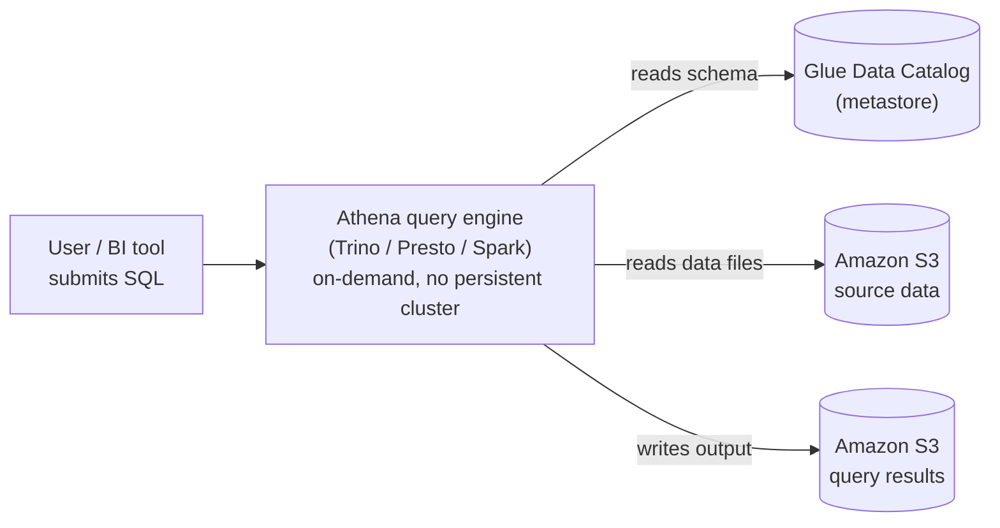

# Amazon Athena — Study Notes

> Covers the README's "Amazon Athena" section (lines 231-413). The hands-on build for this section lives in the repo's `3.athena-code/` folder.

---

## 1. What Athena Is

Athena is a serverless SQL query service. It queries data where the data already lives. It does not load data into itself first.

Athena has two engine choices:

- A SQL engine, built on open-source **Trino** (and the older **Presto**, in earlier engine versions). This is what the README's tutorial uses.
- **Apache Spark**, for notebook-based Spark jobs (see Section 10).

Athena can query:

- Data in Amazon S3 (the main use case, and the one the README tutorial uses).
- Over 30 other data sources through **Federated Query** (RDS, DynamoDB, on-premises databases, other clouds — see Section 11).

Key idea for the exam: Athena has **no infrastructure to manage**. There is no cluster to size, patch, or scale. You submit a query. Athena provisions compute behind the scenes, runs the query, and releases the compute. This is the core "serverless" property the exam tests.

### Pricing model

Two billing modes exist:

- **On-demand (standard DML queries)**: you pay per amount of data scanned, not per query duration and not per row returned. The published rate has long been **$5 per TB scanned**, with a **10 MB minimum charge per query**. Always confirm the current rate on the AWS Athena pricing page before quoting it in a real cost estimate — rates and units can change.
- **Provisioned capacity (Capacity Reservations)**: you reserve a fixed number of DPUs (Data Processing Units) and pay per DPU-hour, regardless of bytes scanned. This gives predictable billing for heavy, steady workloads, where on-demand per-TB pricing would cost more or would be too unpredictable to budget.

Exam framing: **on-demand rewards scanning less data** (this is why partitioning, columnar formats, and compression are heavily tested — they all reduce bytes scanned). **Provisioned capacity rewards steady, high-volume usage** where you would rather pay a flat compute cost than a per-scan cost.

### Athena and the Glue Data Catalog

You already covered the Glue Data Catalog and Glue Crawlers. Athena depends on that same catalog directly:

- Athena has **no metadata store of its own**. Its metastore *is* the Glue Data Catalog.
- When you run `CREATE EXTERNAL TABLE` in the Athena query editor (as the README tutorial does), Athena is not creating a private Athena object. It is writing a table definition into the Glue Data Catalog — the exact same catalog a Glue Crawler populates by scanning S3.
- This means a table a Glue Crawler discovers is immediately queryable from Athena with no extra setup, and a table you define by hand in Athena is immediately visible to Glue ETL jobs, Redshift Spectrum, and any other service that reads the Glue Data Catalog.
- `CREATE DATABASE`, `CREATE EXTERNAL TABLE`, and `ALTER TABLE ADD PARTITION` in Athena are really Glue Data Catalog API calls wearing a SQL front end.

This is the same relationship as: Glue Crawler = one way to populate the catalog (automatic, by inferring schema from files); Athena `CREATE EXTERNAL TABLE` = the other way to populate the catalog (manual, you declare the schema yourself). Both roads lead to the same catalog.

The diagram below shows why Athena counts as "serverless": there is no box in this picture that you provision, patch, or scale yourself. Athena has no storage and no metastore of its own — it borrows both from S3 and the Glue Data Catalog, and spins up query compute only for the duration of the query.



---

## 2. Workgroups

A **workgroup** is how Athena isolates and controls query execution for a team, project, or environment. This repo's own CloudFormation (`3.athena-code/athena.yaml`) defines one:

```yaml
MyAthenaWorkGroup:
  Type: AWS::Athena::WorkGroup
  Properties:
    Name: afnan-DataEngineeringCourseAthenaWorkgroup
    WorkGroupConfiguration:
      BytesScannedCutoffPerQuery: 200000000
      EnforceWorkGroupConfiguration: false
      PublishCloudWatchMetricsEnabled: false
      RequesterPaysEnabled: true
      ResultConfiguration:
        OutputLocation:
          Ref: S3LocationAthenaResults
```

What a workgroup controls, and why each setting is exam-relevant:

- **Query result location** (`ResultConfiguration.OutputLocation`). Athena writes the output of *every* query as a file to S3 — this is true even for a plain `SELECT`. Athena needs somewhere to put that file. This is why the README's setup step asks you to point Cloudformation at an `athena` results folder before you can run any query.
- **Encryption of query results.** You can require SSE-S3, SSE-KMS, or client-side KMS encryption on that results location. This is a workgroup-level or per-query setting.
- **`BytesScannedCutoffPerQuery`**: a hard per-query data-scan limit, in bytes. This is a direct cost control — it kills a query before it can scan (and charge for) more than the configured amount. This repo's workgroup caps every query at 200,000,000 bytes (~200 MB).
- **`EnforceWorkGroupConfiguration`**: if `true`, the workgroup's settings (result location, encryption, engine version, cutoff) override whatever the client/user requests. If `false` (as in this repo), the workgroup's settings are only defaults — a user can override them client-side. The exam tests this override behavior directly: enforcement is what makes a workgroup a real guardrail rather than a suggestion.
- **`PublishCloudWatchMetricsEnabled`**: whether per-query metrics (bytes scanned, execution time, etc.) are pushed to CloudWatch for monitoring/alarming.
- **`RequesterPaysEnabled`**: lets Athena read from S3 buckets configured as "Requester Pays," where the querying account (not the bucket owner) is billed for data transfer.

Practical use: separate workgroups per team or environment give separate cost tracking, separate result locations, and separate scan-limit guardrails — without needing separate AWS accounts.

One encryption gotcha worth remembering: if the **source data** in S3 is encrypted, Athena's query **output is not automatically encrypted to match**. Encryption of results is configured independently, on the workgroup or the query result location.

---

## 3. Athena Engine Versions

Athena runs queries on an "engine version," configured per workgroup:

- **Engine version 2**: based on Presto. Older, being phased out as the default.
- **Engine version 3**: based on Trino. This is the current default for new workgroups, has the larger/more current SQL function library, and is required for Apache Iceberg table support (ACID transactions, `MERGE`, time travel).

Exam framing: if a question mentions Iceberg tables, `MERGE`, or the newest Trino SQL functions in Athena, the answer requires engine version 3.

---

## 4. Cost Optimization: Partitioning

Partitioning is the single highest-yield Athena cost topic on the exam, because Athena's cost model is "pay per byte scanned," and a partition is a physical S3 prefix Athena can skip entirely if a query's `WHERE` clause excludes it.

Two ways a table's partitions become known to Athena, and they behave very differently:

### A. Partitions discovered/registered normally (Glue Crawler, or `MSCK REPAIR TABLE` / `ALTER TABLE ADD PARTITION`)

- Each partition is a **real row of metadata in the Glue Data Catalog** — a mapping of partition key values to an S3 path.
- A Glue Crawler run (re-)discovers partitions by listing S3 and adding new ones to the catalog. `MSCK REPAIR TABLE` does the same thing manually from Athena.
- Cost/scale problem: at very high partition counts (many thousands), Athena has to call the Glue Data Catalog's `GetPartitions` API to plan the query, and this lookup gets slower and can rate-limit as partition count grows.

### B. Partition projection

- Partition values and their S3 paths are **not stored in the Glue Data Catalog at all**. Instead, you declare a formula for them as table properties (`projection.enabled`, `projection.<col>.type` = `enum` / `integer` / `date` / `injected`, plus a path template).
- Athena computes candidate partition values and S3 paths **at query time**, algorithmically, instead of looking them up.
- Benefit: no `GetPartitions` catalog call, no crawler run needed to pick up new partitions (e.g., a new date partition that didn't exist yesterday is queryable today with zero catalog update), and much better performance at very high partition counts.
- Real risk, and a favorite exam trap: if the projection template is misconfigured, Athena does not error — it just computes a path that doesn't exist, scans nothing, and silently returns 0 rows.

Rule of thumb for the exam: **crawler-discovered partitions** = simpler, safer, fine for normal partition counts. **Partition projection** = the answer when the question emphasizes a very large number of partitions, or partitions that follow a predictable pattern (e.g., `dt=YYYY-MM-DD`) and need to be queryable immediately without a crawler run.

---

## 5. Cost Optimization: Columnar Formats and Compression

The README's tutorial only uses CSV/text files. The exam expects you to know why that is a poor choice for anything beyond a demo:

- **Row-based formats (CSV, JSON)**: to read even one column, Athena must read the entire row, for every row. There is no way to skip columns you didn't ask for.
- **Columnar formats (Parquet, ORC)**: data is stored column-by-column. A query that selects 3 columns out of 30 only reads those 3 columns' data off disk — this is called **column pruning**, and it directly reduces bytes scanned (and therefore cost, under on-demand pricing).
- Columnar formats also support **predicate pushdown** (skipping whole blocks of rows using stored min/max statistics) and compress far better than row-based text, because similar values are stored next to each other.
- **Compression** (e.g., Snappy, GZIP, ZSTD) shrinks the bytes actually read from S3, which again reduces both scan cost and query time. Compression is a separate, additive lever on top of choosing a columnar format.

Exam framing: "reduce Athena cost/improve performance" almost always has partitioning, columnar format, and compression as the three correct levers, often as a multi-select or "which combination" question.

---

## 6. Cost Optimization: CTAS (CREATE TABLE AS SELECT)

`CTAS` is the standard way to materialize an improved copy of a dataset — for example, taking the README's raw CSV `customers` table and producing a Parquet, partitioned, compressed version:

```sql
CREATE TABLE customers_optimized
WITH (
  format = 'PARQUET',
  parquet_compression = 'SNAPPY',
  partitioned_by = ARRAY['country']
) AS
SELECT * FROM customers;
```

CTAS both creates a new table definition (in the Glue Data Catalog) **and** writes new data files to S3, in one statement, based on a `SELECT`. This is the standard ETL pattern: land raw data as-is, then use CTAS to produce a query-optimized copy for repeated use — instead of repeatedly re-scanning the raw, unoptimized data.

A related, exam-tested limit: `INSERT INTO` can write **at most 100 partitions per statement**. The documented workaround is to combine CTAS (to create the table and write an initial batch of partitions) with one or more follow-up `INSERT INTO` statements (each covering up to 100 more partitions) to load the rest. This CTAS + INSERT INTO combination is a named pattern in AWS's own documentation for exactly this reason.

---

## 7. Athena for Apache Spark

Athena also offers a Spark engine, accessed through notebooks inside the Athena console — not through the SQL query editor.

Conceptually:

- You write PySpark code in a notebook, run it against Athena's own Spark-compatible compute, and get results back interactively.
- Startup is fast (near-instant session start on a configured workgroup) compared to spinning up a traditional Spark cluster.
- Billing is per DPU-hour (with sub-hour granularity), similar in spirit to Athena SQL's provisioned capacity, but this is a distinct feature from SQL provisioned capacity.
- It still reads the Glue Data Catalog for table metadata, exactly like Athena SQL does.
- Use it when a task genuinely needs Spark's programmatic/distributed-processing model (custom transformation logic, ML libraries, iterative algorithms) — something plain SQL can't express well. If the task is expressible as SQL, the SQL engine is simpler and usually cheaper.

Don't confuse this with **Glue interactive sessions/notebooks** — both give you a notebook over Spark and both use the Glue Data Catalog, but they are separate products (Athena for Spark vs. AWS Glue). The exam distinguishes them by which service's console/billing they run under.

---

## 8. Athena Federated Query

Federated Query lets Athena run SQL against data sources that are **not** in S3, by using **Lambda-based data source connectors**:

- Each connector is a Lambda function (typically deployed from the AWS Serverless Application Repository) that translates a piece of an Athena query into calls against the target system, and returns data back to Athena in a common format.
- AWS publishes 30+ prebuilt connectors: Amazon RDS/JDBC sources, DynamoDB, DocumentDB, Amazon Redshift, CloudWatch Logs, HBase on EMR, and more. A custom connector SDK exists for sources with no prebuilt connector.
- This lets one SQL query in Athena join, say, an operational DynamoDB table with a historical dataset in S3 — without first ETL-ing the DynamoDB data into S3.
- Cost has two parts: normal Athena bytes-scanned pricing, plus the cost of the Lambda invocations the connector makes.
- **Documented limitation, and a good exam trap**: `INSERT INTO` is **not supported against federated data sources**. Federated Query is read-only from Athena's side.

---

## 9. SQL Concepts Walked Through in the Tutorial

The README's tutorial introduces these one syntax element at a time. Below is the underlying concept behind each, not just the example repeated.

**SELECT and column alias** — `SELECT` chooses which columns come back; `SELECT *` returns all of them. `AS` gives a column (or an expression, like a `CONCAT` result) a different name **in the result set only** — it never renames the underlying table column.

**CONCAT** — joins string values end-to-end with **no separator inserted automatically**. `CONCAT(firstname, lastname)` produces `CatherineAbel`, not `Catherine Abel`. To get a space you must add one as its own argument: `CONCAT(firstname, ' ', lastname)`. (The README's own item 5 omits the space, while its later CTE example in item 17 includes it — worth noticing that inconsistency yourself when reading raw exam-style SQL.)

**WHERE** — filters individual rows, evaluated before any grouping/aggregation happens.

**AND / OR** — boolean combinators. `AND` binds tighter than `OR`, same as in most SQL dialects: `WHERE a OR b AND c` is evaluated as `a OR (b AND c)`, not `(a OR b) AND c`. Always add explicit parentheses when mixing `AND` and `OR` — this operator-precedence trap shows up on the exam.

**IN** — shorthand for repeated `OR` checks on the same column: `customerid IN (371, 377)` is equivalent to `customerid = 371 OR customerid = 377`.

**LIKE and wildcards** — `%` matches zero or more of any character; `_` matches exactly one character. `LIKE 'J%'` matches any value starting with `J`. In Athena's Trino/Presto engine, `LIKE` matching is **case-sensitive** by default — don't assume the case-insensitive behavior some RDBMS defaults give you.

**UNION vs UNION ALL** — the README only shows `UNION`, but the exam distinction matters: `UNION` combines two result sets **and removes exact duplicate rows** (it implicitly de-duplicates, which costs an extra sort/hash step). `UNION ALL` combines them **without** removing duplicates, and is cheaper. Default to `UNION ALL` unless you specifically need de-duplication.

**DISTINCT** — removes duplicate rows (or duplicate values of the selected column) from the result.

**COUNT vs COUNT(DISTINCT)** — `COUNT(column)` counts non-null values across all returned rows, including duplicates. `COUNT(DISTINCT column)` counts only the unique non-null values. `COUNT(*)` counts rows regardless of null values in any particular column.

**GROUP BY (and HAVING, which the README's tutorial doesn't cover)** — `GROUP BY` collapses rows that share the same value(s) in the grouped column(s) into one output row per group, and is meant to be paired with an aggregate function (`COUNT`, `SUM`, `AVG`, `MIN`, `MAX`) to compute something *per group*. Note: the README's own example, `SELECT firstname ... GROUP BY firstname` with no aggregate function, doesn't actually demonstrate aggregation — as written, it behaves like `SELECT DISTINCT firstname`. A realistic example would be `SELECT firstname, COUNT(*) FROM customers GROUP BY firstname`. `HAVING` is the filter that runs **after** grouping/aggregation — use it to filter on an aggregate result (e.g., `HAVING COUNT(*) > 1`), because `WHERE` cannot reference an aggregate function.

**Subqueries / nested queries** — a query nested inside another query, used in place of a value, a list of values, or a table. The README's example, `WHERE customerid IN (SELECT customerid FROM customers)`, is a subquery against the *same* table with no extra filter, so it just returns everything already there — it's circular and doesn't show what subqueries are actually for. A realistic use is filtering rows in one table based on values that exist in a *different* table, e.g., customers who appear in the `orders` table.

**CTEs (Common Table Expressions)** — `WITH name AS (subquery) SELECT ... FROM name` gives a subquery a temporary, readable name, scoped to one statement. The main benefits are readability and the ability to reference the same named result set more than once in one query. **The README's own CTE example has a bug worth knowing about**: it defines `cte` but the final `SELECT * FROM customers` queries the original table, not the CTE. As written, the CTE is defined and never used. A correct version ends with `SELECT * FROM cte;`.

**INNER JOIN vs LEFT JOIN** — `INNER JOIN` returns only rows that have a match in both tables. `LEFT JOIN` returns every row from the left (first-listed) table, plus matching data from the right table where it exists, and `NULL` in the right table's columns where no match exists. For completeness (the README only shows these two): `RIGHT JOIN` is the mirror of `LEFT JOIN` (keeps every row from the right table); `FULL OUTER JOIN` keeps every row from both sides, with `NULL`s wherever a side has no match; `CROSS JOIN` produces the full cartesian product of both tables with no join condition at all. All of these are supported by Athena's Trino engine.

---

## 10. Correction: what `INSERT INTO` actually supports (read this before the exam)

The README's tutorial includes:

```sql
INSERT INTO customers (customerid, firstname, lastname, fullname)
VALUES (1221,'John', 'Doe', 'John Doe');
```

against the plain, comma-delimited `customers` table created earlier with `ROW FORMAT DELIMITED ... STORED AS TEXTFILE`. It's worth being precise about what this does and doesn't prove, because this is an easy area to get backwards for the exam.

**What's true, confirmed against current AWS Athena documentation:**

- `INSERT INTO` (both the `... SELECT` form and the `... VALUES` form) **does work on ordinary, non-Iceberg Glue Data Catalog tables** — it is not, and never was, an Iceberg-only feature. `INSERT INTO ... SELECT` was added to Athena in **September 2019**, years before Athena supported Iceberg tables at all. So the common assumption that "plain Hive/CSV tables can't take `INSERT INTO` and this was added specifically for Iceberg" is **not correct** — that assumption gets the history backwards.
- Supported storage formats/SerDes for `INSERT INTO` writes today: **Avro, Ion, JSON, ORC, Parquet, Text file (`LazySimpleSerDe`), and CSV (`OpenCSVSerde`)**.
- There is one real format-specific restriction to know: the **CSV SerDe specifically (`org.apache.hadoop.hive.serde2.OpenCSVSerde`) only supports writing string-typed columns** — you cannot `INSERT INTO` a table using that exact SerDe if its Glue schema has non-string columns.
- This matters for the README's table: `ROW FORMAT DELIMITED FIELDS TERMINATED BY ',' STORED AS TEXTFILE` is technically the **"Text file" format (`LazySimpleSerDe`)** in AWS's own terminology — a distinct format from what AWS calls "CSV" (`OpenCSVSerde`), even though both are comma-delimited data in casual usage. The Text file format has **no such string-only restriction**. So the README's `customers` table (with `customerid BIGINT`) is not blocked by that particular restriction, and the `INSERT INTO ... VALUES` statement as written is plausible against that specific table definition.

**Real limitations that do apply, regardless of format:**

- `INSERT INTO` supports writing at most **100 partitions per statement** (see Section 6, CTAS).
- `INSERT INTO` is **not supported on bucketed tables**.
- `INSERT INTO` is **not supported against federated data sources** (Section 8).
- Each `INSERT` operation writes a **brand-new file** to S3 — it never appends to or rewrites an existing file. AWS's own documentation explicitly recommends **against** using `INSERT INTO ... VALUES` for this reason: repeated single/few-row inserts create many small files, which degrades later query performance (the "small files problem"). CTAS, or batching many rows into one `INSERT ... SELECT`, is the recommended pattern — not row-by-row `VALUES` inserts.
- Ordinary (non-Iceberg) tables get **no transactional guarantees**: there's no `UPDATE`, no `DELETE`, no `MERGE`, and a failed `INSERT`/CTAS can leave orphaned partial files behind that a later query might read.
- **True ACID behavior — `UPDATE`, `DELETE`, `MERGE`, and safe concurrent writes — requires the Apache Iceberg table format specifically**, and requires Athena engine version 3. This is the part of the original assumption that *is* correct: Iceberg is what Athena added for full transactional semantics. It just didn't invent basic `INSERT INTO` — that already existed for plain tables.

**Bottom line for exam purposes:** don't assume "Athena tables can't take `INSERT INTO`" or "you need Iceberg just to insert a row." Both are wrong. Do remember: no update/delete/merge without Iceberg, a 100-partition cap per statement, no bucketed or federated tables, and AWS's own guidance to avoid `VALUES`-style row-by-row inserts in favor of CTAS or batched `INSERT ... SELECT`.

---

## 11. Athena vs Redshift Spectrum vs EMR (for querying data in S3)

You haven't covered Redshift or EMR in this repo yet, so treat this as a preview of a distinction the exam draws often:

| | Best fit when… |
|---|---|
| **Athena** | You want ad hoc, occasional, serverless SQL directly against S3, with nothing to provision and pay-per-query billing. Simplest option, no existing cluster required. |
| **Redshift Spectrum** | You already run a Redshift cluster/serverless workgroup and want a single query to join your existing warehouse tables with data still sitting in S3, without loading that S3 data into Redshift first. Requires a running Redshift environment. |
| **EMR** | You need heavy, custom, large-scale big-data processing — custom Spark/Hive/Flink jobs, ML training pipelines, or workloads that don't fit cleanly into SQL — and you want more control over the processing framework and cluster than either Athena or Redshift Spectrum gives you. |

One-line exam heuristic: **"quick SQL on S3, no infra" → Athena. "Already on Redshift, blend warehouse + S3" → Redshift Spectrum. "Heavy custom processing/ML at scale" → EMR.**

---

## 12. Other README simplifications worth flagging

- Item 5 (`CONCAT`) queries `FROM customer` (singular) — the table created earlier is `customers` (plural). As written, this would fail with a "table not found" error.
- Item 19 (`LEFT JOIN`) queries `FROM order` (singular) — the table created earlier is `orders` (plural). Same issue.
- Item 17 (CTE) defines a CTE but the final `SELECT` reads from `customers`, not from the CTE — the CTE is never actually used (see Section 9 above).
- Item 15 (`GROUP BY`) groups by a column with no aggregate function, which doesn't demonstrate what `GROUP BY` is for (see Section 9 above).
- Item 16 (nested query) is self-referential against the same table and returns everything — it doesn't demonstrate a realistic subquery use case (see Section 9 above).
- The `employees` table schema includes a column literally named `group`. `GROUP` is a reserved SQL keyword (used in `GROUP BY`). Athena/Trino will require it to be quoted (e.g. `"group"`) in queries — an easy thing to trip over if you copy this schema as-is.
- `LOCATION 's3://table-data-location/'` in the `CREATE EXTERNAL TABLE` statements is a placeholder, not a real bucket — remember to point it at your own project's S3 location (following this repo's `afnan-` naming convention) when actually running these statements.

---

## Exam Checklist

- Athena queries data **in place** in S3 (and 30+ other sources via Federated Query); there is no load step and no infrastructure to manage.
- Athena's metastore **is** the Glue Data Catalog — `CREATE EXTERNAL TABLE` in Athena and a Glue Crawler both populate the same catalog.
- On-demand billing = pay per **TB scanned** (~$5/TB, 10 MB minimum per query — verify current rate before quoting). Provisioned capacity = pay per **DPU-hour**, for steady/heavy workloads.
- The three big cost/performance levers, because cost = bytes scanned: **partitioning**, **columnar format** (Parquet/ORC over CSV/JSON), and **compression**. Expect multi-select questions combining these.
- Partitioning has two flavors: **Glue-Crawler/MSCK-discovered partitions** (real catalog entries, simple, fine at normal scale) vs. **partition projection** (computed on the fly from table properties, no catalog lookups, scales to huge partition counts, but silently returns 0 rows if misconfigured).
- **CTAS** is the standard way to materialize a new, optimized copy of a table (new format, new partitioning, new compression) from a `SELECT`. CTAS + `INSERT INTO` together is the documented workaround for `INSERT INTO`'s **100-partitions-per-statement** limit.
- `INSERT INTO` (`SELECT` or `VALUES`) works on **ordinary, non-Iceberg** tables too — this predates Iceberg support in Athena. It does **not** work on bucketed tables or federated sources, is capped at 100 partitions per statement, and AWS recommends against `VALUES`-style row inserts (each `INSERT` writes a new small file — a performance anti-pattern at scale).
- Real transactional behavior — `UPDATE`, `DELETE`, `MERGE`, safe concurrent writes — needs the **Apache Iceberg** table format and **engine version 3**. Plain external tables have none of that.
- **Workgroups** isolate teams/workloads: control query result S3 location, result encryption, per-query byte-scan cutoffs, and whether workgroup settings are enforced over client settings (`EnforceWorkGroupConfiguration`).
- **Engine version 3** (Trino-based) is the current default and is required for Iceberg; **engine version 2** (Presto-based) is legacy.
- **Athena for Apache Spark** = notebook-based Spark inside Athena, billed per DPU-hour, for logic that doesn't fit SQL — distinct from Glue's interactive Spark notebooks.
- **Federated Query** = Lambda connectors for non-S3 sources (RDS, DynamoDB, etc.); billed for bytes scanned plus Lambda cost; does **not** support `INSERT INTO`.
- Choosing an S3 query engine: ad hoc/no infra → **Athena**; already on Redshift, blending warehouse + S3 → **Redshift Spectrum**; heavy custom big-data/ML processing → **EMR**.
- `UNION` removes duplicate rows (costs more); `UNION ALL` keeps duplicates (cheaper) — default to `UNION ALL` unless you need de-duplication.
- `HAVING` filters after `GROUP BY` aggregation; `WHERE` filters before aggregation and cannot reference an aggregate function.
- `AND` binds tighter than `OR` — always parenthesize mixed conditions.

---

## Practice Questions

**Q1.** A retail analytics company runs a small number of ad hoc Athena queries per week against its S3 data lake. Query volume is unpredictable: some weeks have almost no queries, other weeks bring a short burst of large reports for month-end close. The finance team wants Athena spend to track actual usage closely and does not want to pay for reserved compute that sits idle between bursts. Which billing configuration should the data engineer choose?

- A. Configure a Capacity Reservation with a fixed number of DPUs sized for the month-end burst.
- B. Leave Athena on its default on-demand pricing model, billed per amount of data scanned.
- C. Provision a permanently running Amazon EMR cluster sized for peak load and migrate the queries to it.
- D. Purchase Redshift Reserved Nodes and query the S3 data through Redshift Spectrum instead.

**Answer: B.** On-demand pricing charges per TB scanned with no charge when idle — exactly what a spiky, low-average workload needs. Provisioned capacity (A) means paying for reserved DPU-hours even in weeks with almost no queries, the opposite of the finance goal. C replaces a serverless service with a cluster the team must size and keep running, adding idle cost and operational overhead. D introduces a second running service (Redshift) that also incurs cost while idle, and does not fit a workload with no existing Redshift footprint.

---

**Q2.** A data engineering team has a Glue Crawler that runs nightly and populates a table named `raw_events` in a Glue database by scanning a raw S3 prefix. The next morning, a separate analytics team wants to run SQL directly in Athena against that same table, with no additional table creation, schema replication, or export step. Which statement correctly describes what the analytics team can do?

- A. They must first run `CREATE EXTERNAL TABLE` in Athena, because Athena keeps its own metadata store that is separate from the Glue Data Catalog.
- B. They can query the crawler-discovered table immediately in Athena, because Athena's metastore is the same Glue Data Catalog the crawler writes to.
- C. They must export the crawler's schema into an Athena-native catalog using AWS DMS before they can query it.
- D. They can query the table only after enabling Athena Federated Query, since crawler-created tables are outside Athena's reach.

**Answer: B.** Athena has no metadata store of its own — it reads and writes the same Glue Data Catalog that a Glue Crawler populates, so a crawler-discovered table is immediately queryable with no extra step. A is wrong because it invents a separate Athena metastore that does not exist. C invents an unnecessary migration step; DMS is for database replication, not catalog metadata. D is wrong because Federated Query is for non-S3 sources reached through Lambda connectors, not for S3 tables already in the Glue Data Catalog.

---

**Q3.** A shared AWS account is used by several project teams running Athena queries against a common S3 data lake. A platform team wants every team's workgroup to (1) hard-stop any single query that would scan more than a fixed number of bytes, protecting against a runaway or accidental full-table scan, and (2) guarantee that this protection cannot be bypassed by an individual analyst's client-side query settings. Which two configuration steps should the platform team take? **(Choose TWO.)**

- A. Set `BytesScannedCutoffPerQuery` to the desired byte limit on each team's workgroup.
- B. Set `EnforceWorkGroupConfiguration` to `true` on each team's workgroup.
- C. Enable `RequesterPaysEnabled` on each team's workgroup.
- D. Enable `PublishCloudWatchMetricsEnabled` on each team's workgroup.
- E. Set a bucket policy on the query results location that denies public access.

**Answer: A and B.** `BytesScannedCutoffPerQuery` sets the actual per-query scan limit. `EnforceWorkGroupConfiguration` set to `true` is what makes that limit (and other workgroup settings) override whatever the client requests, turning the workgroup into a real guardrail instead of a default a user can override. C controls billing for Requester Pays S3 buckets and has nothing to do with scan limits. D only publishes metrics for monitoring; it does not enforce anything. E is a legitimate security control but does not address bytes-scanned enforcement.

---

**Q4.** A streaming pipeline lands clickstream data in S3 under a pattern like `s3://bucket/clickstream/dt=2026-08-21/hour=14/`, adding a new `dt`/`hour` partition every hour, and the table has accumulated several hundred thousand partitions over the years. Analysts report two problems: new data arriving in the current hour is not queryable right away, and query planning itself has become noticeably slower as the partition count has grown. Which change should the data engineer make?

- A. Schedule the Glue Crawler to run every 5 minutes so new partitions are picked up faster.
- B. Run `MSCK REPAIR TABLE` before every query submitted by analysts.
- C. Configure partition projection on the table, defining the `dt` and `hour` columns' patterns as table properties instead of relying on catalog-registered partitions.
- D. Convert the table's storage format from Parquet to CSV to reduce partition-related metadata overhead.

**Answer: C.** Partition projection computes partition values and S3 paths algorithmically at query time instead of looking them up in the Glue Data Catalog. This removes the `GetPartitions` catalog call that slows down planning at very high partition counts, and it makes a brand-new hourly partition queryable immediately with no crawler run. A only shortens, but does not eliminate, the delay, adds crawler run cost, and does nothing for the `GetPartitions` slowdown. B adds latency to every single query and does not scale as partition count grows. D changes the file format, which is unrelated to how partition metadata is managed.

---

**Q5.** A team stores web log data in S3 as gzip-compressed CSV files with 40 columns per row. Their most common Athena query selects only 3 of those 40 columns with a `WHERE` clause. Data volume is large and stable, query patterns are not changing, but Athena on-demand cost keeps rising with total data volume and each query takes longer to plan and finish. Which single change will reduce the amount of data scanned MOST cost-effectively, without changing the query itself or the query engine?

- A. Increase the workgroup's compute capacity so queries run faster.
- B. Convert the files to Apache Parquet, keeping Snappy compression, so Athena can prune to only the 3 selected columns.
- C. Switch the compression codec from gzip to ZSTD while keeping the CSV row-based layout.
- D. Set `EnforceWorkGroupConfiguration` to `false` so analysts' client-side settings take precedence.

**Answer: B.** Converting to a columnar format enables column pruning: a query selecting 3 of 40 columns only reads those 3 columns' bytes off disk, plus it enables predicate pushdown and denser compression. This directly reduces bytes scanned, which is what on-demand billing charges for. C only changes the compression codec but keeps the row-based CSV layout, so all 40 columns are still read for a 3-column query — a smaller, additive gain compared to column pruning. A does not reduce bytes scanned at all; Athena on-demand pricing is not based on adjustable per-query compute capacity. D is an access-control setting unrelated to bytes scanned or cost.

---

**Q6.** A data engineer needs to migrate five years of raw, unpartitioned CSV sales data into a new table that is Parquet, Snappy-compressed, and partitioned by year and month — roughly 300 total year-month partitions once fully loaded. The engineer submits a single CTAS statement with `PARTITIONED BY (year, month) AS SELECT ...`, and it fails partway through with an error referencing the per-statement partition limit. Which combination of steps should the data engineer take?

- A. Increase the workgroup's `BytesScannedCutoffPerQuery` and re-run the same CTAS statement unchanged.
- B. Switch the target table's format from Parquet to Apache Iceberg so a single CTAS statement can write unlimited partitions.
- C. Let the CTAS statement create the table and write the partitions it can, then load the remaining year-month partitions with one or more follow-up `INSERT INTO ... SELECT` statements, each covering up to 100 more partitions.
- D. Replace the CTAS statement with an `INSERT INTO ... VALUES` statement that inserts one row per partition manually.

**Answer: C.** CTAS combined with follow-up `INSERT INTO ... SELECT` statements is AWS's documented workaround for the 100-partitions-per-statement limit: CTAS creates the table and writes an initial batch, and each additional `INSERT INTO` statement covers up to 100 more partitions until the load is complete. A does not address the failure: `BytesScannedCutoffPerQuery` limits scan cost, not partition count per statement. B is incorrect because moving to Iceberg does not lift the per-statement partition limit; that limit is not tied to Iceberg. D is the specific anti-pattern AWS recommends against — `VALUES`-style row-by-row inserts create one new small file per statement and would be impractical for loading five years of sales data across 300 partitions.

---

**Q7.** A data science team needs to run a custom, iterative PySpark feature-engineering pipeline against tables already registered in the Glue Data Catalog. The logic involves iterative custom transformations that do not translate cleanly into SQL. The team wants to start coding in a notebook within minutes, without provisioning or managing a persistent cluster, and the company does not currently operate a Redshift cluster. Which solution meets these requirements with the LEAST operational overhead?

- A. Use Redshift Spectrum to query the S3 data from a newly provisioned Redshift cluster.
- B. Use Athena's Spark engine through a notebook in the Athena console, which reads table metadata from the Glue Data Catalog.
- C. Provision a long-running Amazon EMR cluster and submit the PySpark job to it.
- D. Rewrite the feature-engineering logic as an Athena SQL `CTAS` statement.

**Answer: B.** Athena for Apache Spark gives near-instant notebook session start on a configured workgroup, requires no cluster to size or patch, and reads the same Glue Data Catalog as Athena SQL — a direct fit for custom, iterative Spark logic with minimal setup. A requires provisioning and paying for a Redshift cluster the company does not have, and Redshift Spectrum is a SQL-only interface, not a Spark notebook environment. C can run the same PySpark code but requires provisioning and managing a persistent cluster, which is exactly the operational overhead the team wants to avoid. D is not viable because the scenario states the logic does not translate cleanly into SQL.

---

**Q8.** A team has connected Athena Federated Query to a production Amazon DynamoDB table using the DynamoDB connector, so they can join live order data with historical order archives already stored as Parquet in S3. Two requests come in: (1) an analyst wants to periodically snapshot the joined DynamoDB + S3 result set into a new, Parquet-formatted table in S3 for fast repeated queries later, and (2) an engineer proposes writing new rows directly into the DynamoDB table using an `INSERT INTO` statement run from Athena. Which two statements are correct? **(Choose TWO.)**

- A. The analyst's snapshot requirement can be met by running a CTAS statement that selects from the federated query and writes a new table to S3.
- B. The engineer's `INSERT INTO` proposal will succeed, because `INSERT INTO` has worked on ordinary Athena tables since before Iceberg was supported.
- C. The engineer's `INSERT INTO` proposal will fail, because Federated Query is read-only from Athena's side and does not support `INSERT INTO` against a federated source.
- D. Both requests will fail, because a Federated Query result cannot be used as input to any other Athena SQL statement.
- E. The engineer's `INSERT INTO` proposal will succeed only if the DynamoDB table is first converted to the Apache Iceberg table format.

**Answer: A and C.** CTAS can materialize any `SELECT` result, including one built on a federated join, into a new S3 table — this is the standard pattern for turning a federated query into a fast, reusable dataset. Separately, Athena documents `INSERT INTO` as unsupported against federated data sources regardless of the target system, so the engineer's proposal fails. B states a true general fact about ordinary Glue Data Catalog tables, but it is the wrong answer here: the federated-source restriction overrides the general rule for this specific target. D is wrong because the analyst's CTAS snapshot does succeed. E is wrong because the federated-source restriction is not about table format — converting to Iceberg does not make a federated source writable from Athena.
