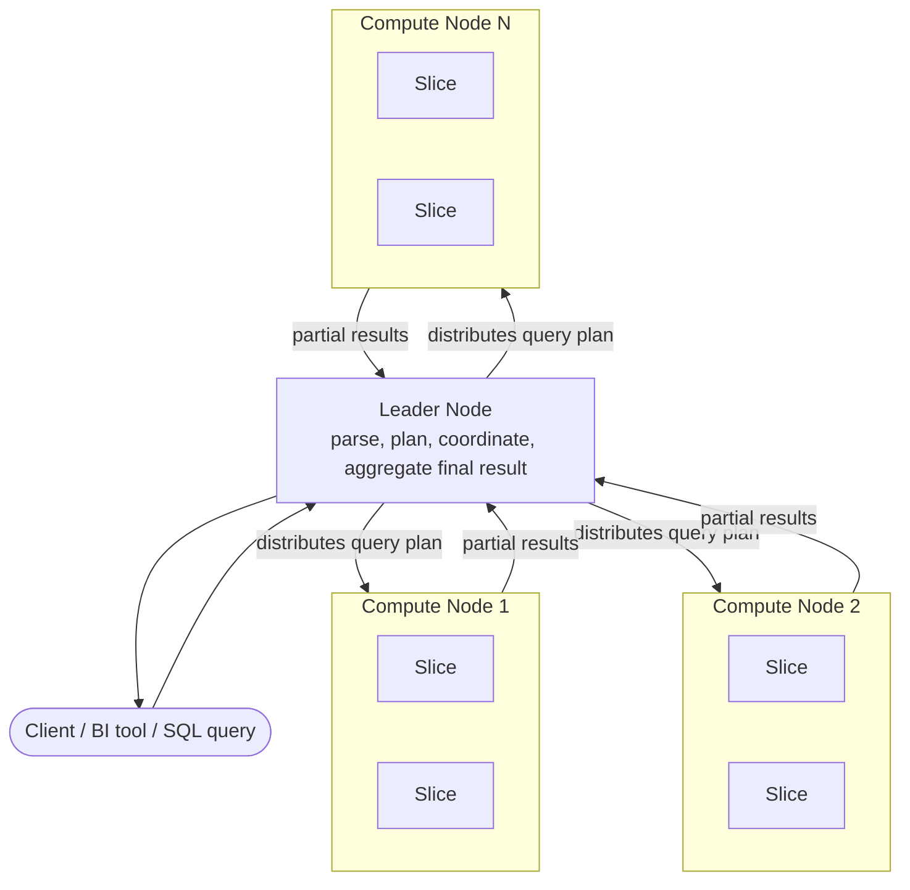
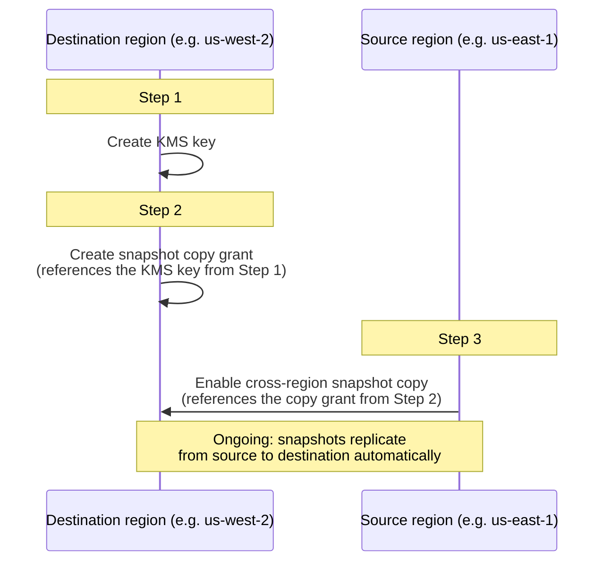

# Amazon Redshift — Study Notes

Covers the README's "Amazon Redshift" section (lines 415–757). Hands-on build lives in `4.redshift-code/` (CloudFormation template `redshift-cluster.yaml`, `dc2.large` single node).

---

## 0. Correction: Redshift is OLAP, not OLTP

The README states: *"Amazon Redshift is designed for Online Analytical Processing (OLTP) workloads."* This is wrong. Redshift is an **OLAP** (Online Analytical Processing) data warehouse. OLTP is a different workload shape, served by different AWS services. This distinction is one of the most frequently tested concepts on the DEA-C01 exam, so it is worth understanding properly rather than just memorizing the acronym swap.

| | OLTP (Online Transaction Processing) | OLAP (Online Analytical Processing) |
|---|---|---|
| Purpose | Run the business (order entry, bookings, payments) | Analyze the business (reporting, BI, trend analysis) |
| Query pattern | Many short reads/writes, single-row lookups | Few, large queries scanning millions of rows |
| Read/write mix | Read-heavy AND write-heavy, low latency required | Read-heavy, batch/bulk writes, latency tolerant |
| Schema | Normalized (3NF) — minimizes write anomalies and duplication | Denormalized (star/snowflake schema) — minimizes joins and speeds scans |
| Storage layout | Row-oriented (a full row is one purchase, one login) | Column-oriented (a query touches a few columns across many rows) |
| Concurrency | Thousands of small, isolated transactions | Fewer, heavier, long-running queries |
| AWS services | RDS, Aurora, DynamoDB | **Redshift**, Athena, EMR (for analytics) |

Why this matters mechanically: an OLTP engine is built to append/update single rows fast and safely (ACID transactions, row storage, indexes for point lookups). An OLAP engine is built to scan and aggregate huge column ranges fast (columnar storage, compression, massively parallel execution) — it is comparatively slow at single-row inserts/updates and does not optimize for that pattern.

Exam angle: if a question describes "order processing system, needs low-latency single-record reads/writes" → RDS/Aurora/DynamoDB. If it describes "nightly reporting, aggregate millions of sales rows, BI dashboards" → Redshift. The README's OLTP label would point you the wrong way if taken literally — Redshift is the OLAP answer.

---

## 1. Architecture: leader node, compute nodes, slices

The README only briefly touches architecture. This matters because distribution styles, sort keys, and WLM all sit on top of it.

- **Leader node** — receives client connections (JDBC/ODBC/query editor), parses and plans SQL, builds the execution plan, coordinates compute nodes, and does final result aggregation (e.g., combining partial `SUM()` results from each node). It does not store table data itself. In a single-node cluster the leader and compute role are combined on that one node.
- **Compute nodes** — execute the compiled query plan in parallel and store the actual table data. Each compute node has its own CPU, memory, and attached storage. This is the "massively parallel processing" (MPP) layer.
- **Slices** — each compute node is partitioned into slices. A slice is the unit of parallel work: it gets an allocated share of the node's memory and disk, and processes a portion of the node's workload independently. The number of slices per node depends on node type/size (more vCPU = more slices). Every table's rows are distributed across slices according to the table's distribution style.

Why this matters: a query is only as fast as its **slowest slice**. If a distribution style causes rows to land unevenly across slices (data skew), one slice does far more work than the others, and the whole query waits on it. This is the mechanical link between architecture and the distribution-style choices in Section 3.

Data flow for a query: client → leader node (parse, plan, distribute plan to compute nodes) → compute nodes execute in parallel across their slices → compute nodes return partial results to leader → leader aggregates/sorts → result to client.

---

## 2. Durability and the three resize methods

**Durability**: data is replicated within the cluster (across nodes) for durability against node failure, and automated snapshots back the cluster up to S3. Snapshots can be copied cross-region asynchronously for disaster recovery. A standard cluster lives in a single Availability Zone; only RA3 clusters support relocating to another AZ (via Redshift's AZ relocation capability, layered on managed storage in S3).

### Resize methods compared

| | Elastic Resize | Classic Resize | Snapshot & Restore |
|---|---|---|---|
| What changes | Node **count** only, same instance/node type (limited node-type family changes are also supported today, but the classic exam framing is "same type, different count") | Node count **and/or** instance/node type | Nothing changes in place — a new cluster is created, then the old one is classic-resized |
| Availability during operation | Brief interruption only, typically a few minutes; Redshift tries to preserve open connections | Cluster is in **read-only** mode for the duration | Original cluster stays fully available (read/write) the whole time — traffic is cut over to the new cluster instead |
| Typical duration | Minutes | Can run for hours, even days, depending on data volume | Snapshot + restore is comparatively fast (roughly proportional to snapshot restore time), but the *follow-on* classic resize of the original cluster still takes hours |
| Node count constraint | Depends on node type/size — most sizes allow roughly double or quarter the current count (see below); minimum 2 nodes for elastic resize | No such doubling constraint — any target node count/type combination Redshift supports | N/A — it wraps a classic resize |
| When the exam picks it | "Quickly add capacity, minimal downtime, same node type" | "Change node type" or "resize outside elastic resize's allowed node-count range" | "Zero/near-zero downtime is a hard requirement" and a classic resize is otherwise unavoidable |

Elastic resize node-count limits (exam-relevant nuance, not just "double/halve"): for most node families you can resize to between roughly a quarter and four times the current node count, though the exact multiplier depends on the node type/size (e.g., dc2.8xlarge and ra3.xlplus historically allowed half-to-double; some ra3 sizes allow quarter-to-4x). The precise ratio is not usually what's tested — what's tested is the *concept*: elastic resize has a bounded range and keeps the same node type, classic resize has no such range but costs read-only downtime, and snapshot & restore is the pattern for avoiding downtime altogether by standing up a second cluster.

Snapshot & Restore workflow, spelled out: (1) take a snapshot of the live cluster, (2) restore it to a new cluster already sized/typed correctly, (3) cut traffic over to the new cluster, (4) classic-resize (or decommission) the original at leisure since it no longer serves traffic, (5) shut down the original once you are satisfied. This trades cost (you run two clusters briefly) for zero read/write downtime on the production path.

---

## 3. Distribution styles

Four styles: AUTO, EVEN, KEY, ALL.

- **AUTO** — Redshift picks the style and can change it as the table grows (e.g., starts as ALL for a small new table, migrates to EVEN or KEY as row count grows), applied in the background with minimal query impact. Good default when you don't yet know the access pattern.
- **EVEN** — round-robin across slices, ignoring column values. Use when the table doesn't participate in joins, or there's no clear KEY/ALL winner.
- **KEY** — rows distributed by the hash of one column's values; matching values land on the same slice. Best for large tables that participate in joins, **if** you pick a key that (a) has high cardinality (avoids skew) and (b) is the join column used by co-located queries.
- **ALL** — full table copy on every node. Good for small, slow-changing dimension tables used in many joins; avoids network redistribution at join time entirely, but write operations get more expensive since every node must apply the change.

### Why a poor DISTKEY choice hurts

Two distinct failure modes:

1. **Data skew** — if the chosen key has low cardinality or a heavily skewed value distribution (e.g., a `status` column that's 90% `"completed"`), most rows hash to the same slice(s). That slice does disproportionate work, storage is uneven, and the whole query is gated by the busiest slice — the MPP parallelism advantage from Section 1 is lost.
2. **Redistribution/broadcast cost at join time** — if two tables in a join are **not** distributed on their join key (or are distributed on different keys), Redshift cannot join matching rows locally. It has to move data across the network first: either **redistributing** one/both tables by the join key on the fly, or **broadcasting** a full copy of the smaller table to every node (similar in effect to an implicit ALL for that join). Both cost network I/O and add latency, and this happens per-query, repeatedly, unlike ALL/KEY which is paid once at load time.

So the goal of DISTKEY selection is: pick the column that (a) is used to join this table to its largest/most frequent join partner, and (b) has enough distinct values to spread rows evenly across slices.

### Connecting to the capstone project

In the retail ETL capstone, `fact_sales` used `DISTSTYLE KEY` with `DISTKEY(customer_key)`, plus `COMPOUND SORTKEY(date_id, customer_key)`. That is a direct application of this rule: `customer_key` was presumably both a common join column (fact-to-dimension join against a customer dimension) and high enough cardinality to distribute evenly across slices, avoiding both skew and repeated redistribution during customer-based joins/aggregations. The compound sort key on `(date_id, customer_key)` is a separate, complementary optimization — it enables range-restricted scans (zone maps let Redshift skip whole blocks outside a date range) and clusters rows so a merge join on `customer_key` within a date range needs less work. Distribution answers "which slice does this row live on"; sort key answers "in what order do rows sit within a slice's disk blocks."

If a dimension table (e.g., a small, rarely-changing product or store dimension) is joined against `fact_sales` frequently, that dimension would be a strong ALL-distribution candidate — it avoids redistributing/broadcasting it on every fact-table join.

---

## 4. COPY, UNLOAD, and ingestion patterns

### COPY (load into Redshift)

- Parallel by design: splitting the load across **multiple files** (ideally a multiple of the number of slices) lets each slice load a piece concurrently. A single large file forces a single slice to do all the work — no parallelism.
- Sources: S3, an EMR cluster (HDFS), a remote host via SSH, or directly from a DynamoDB table.
- Can decrypt and decompress on the way in, and Redshift automatically applies its own compression encodings when storing the data (see the `ENCODE` clauses in the tutorial DDL — `az64`, `lzo`, `raw`).
- **Manifest files**: a JSON file listing the exact set of S3 object keys to load (with optional per-file metadata like expected size). Use a manifest when file naming is inconsistent, when you need to guarantee an exact, auditable set of files loaded (not "everything matching this prefix"), or when files are spread across buckets/prefixes that a simple prefix match can't express.
- Narrow-but-tall exception: the README's note is correct — if a table has few columns but huge row counts, a single COPY with one large file can outperform artificially splitting it, because the per-slice overhead of many tiny files can outweigh the parallelism benefit. The general rule ("split into multiple files") is a rule of thumb, not absolute.

### UNLOAD (export from Redshift)

- Runs a SQL query and writes the result to S3 as one or more files (parallel by default), in text/CSV, JSON, or Parquet.
- Encryption: SSE-S3 by default; can specify SSE-KMS or client-side encryption with a customer-managed key.
- Useful options: `MANIFEST` (writes a manifest describing the unloaded files — useful for downstream tools that need the exact file list), `PARALLEL OFF` (forces single-file output, at the cost of parallelism — used when a single output file is a hard requirement), `PARTITION BY` (writes Hive-style partitioned output, useful when the unloaded data will be crawled/queried by Athena or Spectrum), and compression options (`GZIP`, `BZIP2`, `ZSTD`).

### Redshift Auto-Copy from S3

Configures Redshift to automatically trigger a COPY job when new files land in a specified S3 path — removes the need to build custom event-driven ingestion (e.g., Lambda + S3 event notifications) just to load new files as they arrive.

### Zero-ETL from Aurora

Continuously and automatically replicates data from an Aurora (MySQL- or PostgreSQL-compatible) database into Redshift, without a user-managed ETL pipeline (no Glue jobs, no COPY scheduling). This is for near-real-time analytics over transactional data without building/maintaining a replication pipeline yourself. Zero-ETL integrations also exist for other sources beyond Aurora (e.g., DynamoDB), but the README's Aurora case is the one to know cold for the exam.

### Streaming ingestion (Kinesis / MSK)

Redshift can ingest directly from Kinesis Data Streams or Amazon MSK (Kafka) using streaming ingestion — data lands in a materialized view backed by the stream, queryable with regular SQL, without a separate consumer application (e.g., no need for Kinesis Data Firehose or a Lambda consumer) sitting in between.

### Cross-region snapshot copy (exam favorite) — why each step exists

The scenario: an encrypted Redshift cluster's automated/manual snapshots need to be available in a second AWS Region for disaster recovery. The steps, and *why* each one is necessary:

1. **Create a KMS key in the destination region.** Snapshots of an encrypted cluster are themselves encrypted. Encryption keys are regional — a KMS key in the source region cannot be used to encrypt/decrypt something in the destination region, so a destination-region key must exist before anything can be copied there.
2. **Create a snapshot copy grant in the destination region, naming the KMS key from step 1.** This grant is Redshift's way of getting permission to use *that specific destination-region key* on your behalf when it re-encrypts the incoming snapshot data in that region. Without the grant, Redshift has a key but no authorization construct tying "this cross-region copy operation" to "permission to use this key."
3. **In the source region, enable cross-region snapshot copy on the cluster, pointing it at the destination region and the copy grant created in step 2.** This is the switch that actually starts the ongoing snapshot replication; it needs the grant from step 2 as a parameter because that's what tells the source cluster's copy process which destination key/grant to use for re-encryption.

The ordering is not arbitrary: you cannot create a grant for a key that does not exist yet (step 1 before 2), and you cannot enable copying while referencing a grant that does not exist yet (step 2 before 3). If the source cluster is unencrypted, the KMS key/grant steps are unnecessary — this whole dance is specifically for KMS-encrypted clusters.

The diagram below shows the same three steps as a cross-region dependency chain: everything in the destination region must exist before the source region can reference it.

---

## 5. Workload Management (WLM)

Queries are routed into **query queues**. Each queue has a memory allocation (a portion of the cluster's total memory) divided among a fixed number of **query slots**; each running query occupies a slot for its duration. If a queue's slots are full, new queries to that queue wait.

### Automatic vs Manual WLM

- **Automatic WLM** (AWS-recommended default): Redshift estimates each query's resource needs and dynamically adjusts concurrency. Heavy queries (large hash joins) → lower concurrency (more resources each); light queries (inserts, deletes, simple scans) → higher concurrency. Up to 8 queues, each configurable with priority, concurrency scaling mode, user groups, query groups, and query monitoring rules. This removes the need to hand-tune slot counts/memory splits — Redshift's optimizer does it per-query.
- **Manual WLM**: you explicitly define memory-per-slot and slot count per queue. One default queue (concurrency 5) plus a superuser queue (concurrency 1) always exist; up to 8 user-defined queues, each up to concurrency 50. You control routing to queues by user group or query group at runtime, and can set rules to cancel queries that run too long. Manual WLM is chosen when you need deterministic, reproducible resource guarantees for specific workloads (e.g., "the nightly ETL job always gets exactly this much memory") rather than letting the optimizer decide — but it requires ongoing tuning as workloads change, which is why AWS recommends Automatic WLM as the default.

### Concurrency Scaling

When enabled on a queue, Redshift transparently spins up additional **transient clusters** in the background when queueing is detected, and routes eligible queries to them — so users don't wait behind a backlog on the main cluster. Both the main cluster and scaling clusters see the same (current) data since they share the same underlying storage. Originally read-only; write-query concurrency scaling (COPY, INSERT, UPDATE, DELETE, CTAS, VACUUM, materialized view refresh) is now supported, but only on **RA3** node types, and it excludes DDL, temp tables, Lambda UDFs, and interleaved-sort-key tables. Mechanism: it is an elastic burst capacity layer that activates only when a queue would otherwise queue queries, not an always-on second cluster.

### Short Query Acceleration (SQA)

Mechanism: SQA uses machine learning to predict which queries will be short-running (based on query characteristics, historically observed run time, etc.), then dynamically carves out a **dedicated execution path** for those predicted-short queries so they never sit in a WLM queue behind a long-running query. It only applies to queries Redshift predicts as short **and** that are submitted through a user-defined (not superuser) queue; it favors read-only queries and CTAS. When SQA is enabled, you can typically shrink the WLM queues otherwise reserved just for "fast query priority," because SQA now handles that job structurally — this simplifies WLM configuration.

When to choose which: Automatic WLM + SQA + Concurrency Scaling is the low-maintenance combination AWS recommends for most workloads and is generally the safe exam answer for "minimize query wait time with minimal admin overhead." Manual WLM is the answer when the scenario explicitly demands guaranteed, fixed resource carve-outs per workload/team.

---

## 6. Node families: RA3 vs the legacy DC2/DS2 (and what's changed since)

**RA3** decouples compute from storage: data lives in **Redshift Managed Storage**, backed by S3, rather than on node-local disk. Compute nodes cache hot data locally (with tiering to S3 for less-frequently-accessed data), so you scale nodes for CPU/memory/IO needs and pay for storage separately based on actual data volume — you are no longer forced to add nodes just because you're running out of local disk. This decoupling is also what enables data sharing (Section 8) and AZ relocation.

**DC2 (Dense Compute)** and **DS2 (Dense Storage)** are the older node families, both using **node-local storage** — compute and storage are coupled, so scaling storage means scaling nodes (and vice versa) even when you don't need both.

What the exam (as written, pre-2025 course content) expects: know that RA3 = compute/storage decoupled, managed storage on S3; DC2/DS2 = local SSD storage, compute and storage scale together. RA3 is "the modern node type," DC2/DS2 are "the legacy node type with the coupling problem."

**What has changed in the real service since this course was authored** (worth knowing so you don't get confused if you check the console): AWS deprecated **DC2 and DS2** — no new DC2/DS2 clusters could be created after May 15, 2025, and DC2 reaches end-of-life April 24, 2026; existing clusters must migrate to RA3, the newer **RG (Graviton-based)** node family, or Redshift Serverless. RG, launched in 2026, is now AWS's recommended node family for new provisioned clusters (Graviton-based, faster and cheaper per vCPU than RA3). None of this changes the *concept* tested on the exam (managed/decoupled storage vs local/coupled storage) — RA3 vs DC2/DS2 is still almost certainly the framing used in DEA-C01 questions — but if you provision anything hands-on today, expect the console to steer you toward RA3 or RG rather than letting you create DC2/DS2.

---

## 7. Redshift ML, Data Sharing, Lambda UDFs, Federated Queries

### Redshift ML

Lets you create, train, and deploy ML models using SQL (`CREATE MODEL ...`) directly against data already in Redshift. Under the hood, Redshift ML uses **Amazon SageMaker Autopilot** to select an algorithm, train, and tune the model; the trained model is then made available for inference via a SQL function you can call in ordinary queries. The value proposition: no need to export data out to a separate ML pipeline/notebook — a SQL-fluent user can train and use models without writing Python.

### Data Sharing

Producer/consumer architecture: a **producer** cluster/namespace creates a datashare and grants access to specific objects (schemas, tables, views); a **consumer** cluster/namespace/account/region attaches to that datashare and queries the data as if it were local — live, with no copying, no ETL. Billing: the producer pays for storage (once), each consumer pays for its own compute used to query the shared data. **Requires managed storage** — supported on all RA3 provisioned cluster sizes and Redshift Serverless; not supported on DC2/DS2, because Data Sharing is built on Redshift Managed Storage, which those older node types don't have.

### Lambda UDFs

Lets you call an AWS Lambda function from inside a SQL query as a scalar user-defined function, e.g. `SELECT lambda_multiply(a,b) FROM t1`. Supported Lambda runtime languages include Java, Go, PowerShell, Node.js, C#, Python, and Ruby (whatever the underlying Lambda function is written in — Redshift just invokes it). Redshift needs IAM permission to invoke the function, and each invocation incurs normal Lambda invocation charges on top of Redshift costs. Use case: reuse existing business logic (e.g., a fraud-scoring function) already implemented as a Lambda, from within SQL, instead of reimplementing it as a Redshift UDF.

### Federated Queries

Lets Redshift query live data in an RDS or Aurora (PostgreSQL/MySQL-compatible) database **without moving it first**. Mechanism: create an `EXTERNAL SCHEMA` in Redshift that maps to a schema in the remote RDS/Aurora database; Redshift authenticates to that database using credentials stored in **AWS Secrets Manager** (referenced via `SECRET_ARN`), and an IAM role authorizes Redshift to retrieve that secret. This lets you join operational (OLTP) data with warehouse (OLAP) data in one query, or selectively pull fresh transactional data into Redshift via `CREATE TABLE AS SELECT` against the federated schema, without a full ETL pipeline for exploratory/ad hoc needs.

---

## 8. System tables and views: SVV / SYS / STL / STV / SVCS / SVL

The README's descriptions are mostly right but slightly imprecise about scope. Corrected/verified against AWS documentation:

- **STL (log-based)** — generated from logs **persisted to disk**; give you a history of system activity. Retention is limited (roughly a few days, depending on log volume/available disk space) — they are not a permanent audit trail.
- **STV (virtual/in-memory)** — snapshots of **current, transient, in-memory** system state. Not disk-persisted, not historical — querying an STV table shows you what's true right now.
- **SVV** — views that reference **STV** tables (i.e., they layer a more usable/joinable view on top of the transient in-memory STV data). The README's description ("contain information about database objects with references to transient STV tables") is essentially correct.
- **SVL** — views that reference **STL** tables (a more usable layer on top of the persisted log data), scoped to the **main cluster** only.
- **SVCS** — same idea as SVL, but scoped to cover queries running on **both the main cluster and any concurrency-scaling clusters**. The README's description here is correct.
- **SYS** — the odd one out: these are the monitoring views for **both provisioned clusters and Serverless workgroups**, and are the newer, actively-developed monitoring interface (e.g., `SYS_QUERY_HISTORY`). The README's description ("used to monitor query and workload usage for provisioned clusters and serverless workgroups") is correct.

Practical takeaway for the exam: if a question emphasizes "persisted / historical," think STL/SVL. If it emphasizes "current / real-time / in-memory," think STV/SVV. If it mentions concurrency scaling clusters explicitly, think SVCS. If it mentions Serverless, think SYS.

---

## 9. Redshift Serverless

Runs Redshift without provisioning or managing cluster nodes. Capacity is expressed in **RPUs (Redshift Processing Units)**; Redshift Serverless scales RPU capacity automatically based on workload, and you're billed for RPU-seconds used — good fit for unpredictable, spiky, or intermittent workloads (e.g., dev/test environments, sporadic reporting) where paying for an always-on provisioned cluster would be wasteful. There is no manual WLM configuration in Serverless — it manages its own concurrency/resource allocation automatically, consistent with its "no infrastructure to tune" positioning.

**Correction to the README**: the README states Redshift Serverless has "no public endpoints available." This is outdated. Redshift Serverless workgroups **do** support a "Publicly accessible" toggle — enabling it allocates an Elastic IP so clients outside the VPC can connect, the same general model as a provisioned cluster's public accessibility setting. Separately, as of January 2025, AWS changed the **default** for both new provisioned clusters and new Serverless workgroups to be **private by default** (VPC-only) — public access must be explicitly turned on. So: private-by-default is currently accurate, "no public endpoint possible at all" is not.

---

## 10. Redshift Spectrum

Lets you query data sitting in S3 directly, using ordinary SQL from your Redshift cluster, without loading it in first. Mechanism: you register the S3 data's schema as external tables in the **AWS Glue Data Catalog** (creatable via DDL run from Redshift itself, or via Glue/Athena/any tool that talks to the Glue Data Catalog), then query those external tables from Redshift joined against native Redshift tables if needed. Critically, Spectrum queries run on a **separate, Redshift-managed compute fleet outside your cluster** — so a heavy Spectrum scan doesn't consume your cluster's WLM slots/memory the way a normal query would. Typical use: querying infrequently-accessed historical data, or data too large/costly to load wholesale into the cluster, while still joining it against "hot" data that does live in Redshift.

---

## 11. Other README items worth a flag

- **Vacuum commands**: the README's four Vacuum types (Full, Delete Only, Sort Only, Reindex — Reindex specifically for interleaved sort keys) are accurate. Worth knowing: Redshift automatically runs background sort and `VACUUM DELETE` operations now, so manual `VACUUM FULL` is needed far less often than it used to be — it's mainly for after large bulk deletes/updates, or to force a resort immediately rather than waiting on the automatic background process.
- **"Redshift can be scaled both horizontally and vertically"** — true, but be precise: Elastic resize is horizontal only (same node type, more/fewer nodes); Classic resize can be either horizontal, vertical, or both (different node type, different count). Snapshot & Restore is a deployment pattern around a Classic resize, not a distinct scaling dimension.
- **Concurrency scaling "read and write queries"** — the README states this as if it always applied; in practice write-query concurrency scaling is RA3-only and was added later than read scaling, and it has real exclusions (DDL, temp tables, Lambda UDFs, interleaved sort keys). Don't assume every write is eligible.
- **COPY "can load from an EMR cluster"** — accurate but easy to misread as "load from an EMR-managed table"; it specifically means reading files from HDFS on an EMR cluster, analogous to reading files from S3.

---

## Exam checklist

- Redshift is **OLAP**, not OLTP. OLTP → RDS/Aurora/DynamoDB (normalized, row-store, low-latency single-row ops). OLAP → Redshift (denormalized/star schema, columnar, large scans).
- Leader node plans/coordinates and returns final results; compute nodes store data and execute in parallel; each compute node is split into slices, the real unit of parallel work. Query speed is bounded by the busiest slice.
- Resize methods: **Elastic** = fast, same node type, bounded node-count range, brief availability blip. **Classic** = any node type/count change, hours-to-days, cluster is read-only throughout. **Snapshot & Restore** = zero-downtime pattern that wraps a Classic resize on a throwaway cluster copy while the original keeps serving traffic.
- Distribution styles: AUTO (default, adapts over time), EVEN (round robin, no join affinity), KEY (hash by column — pick a join column with high cardinality to avoid skew and avoid redistribution/broadcast cost at join time), ALL (full copy per node — good for small, slow-changing dimensions, costly to write). Capstone example: `fact_sales` used `DISTKEY(customer_key)` to co-locate customer joins and spread rows evenly.
- COPY parallelizes across multiple files (matches slice count ideally); a manifest pins an exact file list. UNLOAD writes CSV/JSON/Parquet to S3, parallel by default, SSE-S3/SSE-KMS/client-side encryption options. Auto-Copy = trigger COPY on new S3 files. Zero-ETL = continuous Aurora→Redshift replication with no pipeline to manage. Streaming ingestion = direct materialized-view-backed reads from Kinesis/MSK.
- Cross-region snapshot copy order: (1) KMS key in destination region → (2) snapshot copy grant in destination region referencing that key → (3) enable cross-region copy in source region referencing that grant. Only needed for KMS-encrypted clusters.
- WLM: Automatic WLM (AWS-recommended, dynamic concurrency by query weight) vs Manual WLM (fixed slots/memory, deterministic but needs tuning). Concurrency Scaling bursts extra transient clusters only when a queue would otherwise back up; write-query scaling is RA3-only with exclusions. SQA uses ML to predict short queries and runs them on a dedicated fast path, bypassing the queue — lets you shrink dedicated "fast" queues elsewhere.
- RA3 = compute/storage decoupled, S3-backed managed storage, enables Data Sharing and AZ relocation. DC2/DS2 = local SSD, compute and storage scale together (both are now deprecated/EOL in the real service; RA3 remains the exam's "modern" answer, RG is the newest generation beyond what the exam likely covers).
- Data Sharing requires managed storage: RA3 or Serverless only, never DC2/DS2. Producer pays storage once, each consumer pays its own compute.
- Federated Queries: `EXTERNAL SCHEMA` → RDS/Aurora, credentials via Secrets Manager, IAM role authorizes the retrieval — query live OLTP data from Redshift without moving it.
- System objects: STL = persisted log history (limited retention). STV = current in-memory snapshot. SVV = view over STV. SVL = view over STL, main cluster only. SVCS = like SVL but includes concurrency-scaling clusters too. SYS = monitoring for provisioned clusters and Serverless.
- Redshift Serverless: capacity in RPUs, no manual WLM, private-by-default since Jan 2025 but a public-accessible toggle does exist (README's "no public endpoints" claim is outdated).
- Redshift Spectrum: queries S3 data registered in the Glue Data Catalog, runs on separate Redshift-managed compute outside your cluster — doesn't consume your cluster's WLM capacity.

---

## Practice Questions

10 original, scenario-based questions modeled on the DEA-C01 exam format, covering the highest-yield topics from the sections above. Answers and explanations are based only on the facts established in this file.

### Q1 — OLAP vs OLTP workload placement

A ride-sharing company has two distinct workloads. The first is the live trip-booking system, which needs to insert and update individual ride records within milliseconds as riders request trips, drivers accept, and trips complete, with thousands of small transactions per second. The second is a nightly analytics job that scans two years of historical trip and payment data, aggregating it into revenue and utilization reports for the finance team. The data engineering team must choose the right AWS service for each workload, matching the workload's read/write pattern and schema design to the service it's built for. Which pairing correctly matches each workload to the AWS service designed for it?

A. Use Amazon Redshift for the live booking system (row-store, low-latency single-row transactions) and Amazon Aurora for the nightly analytics reports (columnar, large aggregate scans).
B. Use Amazon Aurora for the live booking system (normalized schema, low-latency single-row transactions) and Amazon Redshift for the nightly analytics reports (denormalized/columnar, large aggregate scans).
C. Use Amazon Redshift for both workloads, since Redshift is designed to handle Online Transaction Processing (OLTP) as well as analytical workloads.
D. Use Amazon Aurora for both workloads, since Aurora automatically switches between row-store and columnar storage depending on the query pattern.

**Answer: B**

Aurora is built for OLTP: normalized schema, row storage, fast low-latency single-row reads/writes, high transaction concurrency. Redshift is built for OLAP: denormalized/star schema, columnar storage, large scans and aggregations. A reverses this pairing. C repeats a common misconception — Redshift is OLAP, not OLTP, and is comparatively slow at single-row inserts/updates because it is optimized for scanning and aggregating column ranges, not for transactional row-level operations. D describes a capability Aurora does not have; it does not automatically switch storage engines based on query pattern.

### Q2 — Architecture: leader node, slices, and system tables

A data engineering team at a logistics company runs a large join query against a 12-node RA3 cluster. The query's execution time is far higher than expected, and the team suspects that one particular compute node is doing much more work than the others because of uneven data distribution across slices. They want to inspect a Redshift system object right now to confirm the current, real-time distribution of table blocks across slices, without waiting on anything written to disk. They also want to understand, at a conceptual level, why an imbalance on even a single slice can slow down the entire query. Which combination of a system object and an architectural explanation is correct?

A. Query STV_BLOCKLIST, which reflects current in-memory slice/block state; the query's total runtime is bounded by its slowest slice, because the leader node must wait for every slice to finish before it aggregates and returns the final result.
B. Query STL_QUERY, which reflects historical log data persisted to disk; the leader node stores all table data itself, so an imbalance in the leader node's storage explains the slowdown.
C. Query SVL_QLOG, which is scoped to the main cluster's persisted logs; any slice imbalance is automatically corrected by concurrency-scaling clusters before the query completes.
D. Query SYS_QUERY_HISTORY; slices are a Redshift Serverless-only concept, so this imbalance could not occur on a provisioned RA3 cluster.

**Answer: A**

STV tables hold current, in-memory, non-persisted state, so they answer "what's true right now" without needing disk-persisted logs. Architecturally, compute nodes execute in parallel across slices, but the leader node coordinates and performs final aggregation only after every slice returns its portion of the work — so the slowest slice sets the pace for the whole query. B is wrong on two counts: STL is disk-persisted log data, not real-time, and the leader node does not store table data — compute nodes do. C is wrong: SVL is also disk-log-based, not real-time, and concurrency-scaling clusters burst extra query capacity when queueing occurs — they do not detect or correct data-distribution skew. D is wrong: slices exist on provisioned clusters too (every compute node is split into slices); SYS views do cover both provisioned and Serverless, but the claim that slices are Serverless-only is false.

### Q3 — Resize methods: migrating off a deprecated node type with zero downtime

A subscription analytics company runs a single production DC2 cluster that serves live customer-facing dashboards around the clock. Because of DC2's upcoming end-of-life, the data engineering team must move this workload onto an RA3 node type before the deprecation deadline. The dashboards have a strict requirement: no read/write downtime or read-only period is acceptable at any point during the migration, even briefly. The team has budget approval to run a second cluster temporarily to achieve this. Which solution will meet these requirements with the LEAST impact to the live dashboards?

A. Perform an Elastic resize on the existing cluster directly from DC2 to the target RA3 node type and size.
B. Perform a Classic resize on the existing cluster directly from DC2 to the target RA3 node type and size.
C. Take a snapshot of the DC2 cluster, restore it to a new RA3 cluster, validate it, then cut dashboard traffic over to the new cluster before decommissioning the old one.
D. Enable Concurrency Scaling on the DC2 cluster so a transient cluster absorbs traffic during the migration window.

**Answer: C**

Snapshot & Restore keeps the original cluster fully available for read and write the entire time, since traffic only cuts over once the new RA3 cluster is validated and ready — this is the only option with no downtime window at all. A is wrong: Elastic resize is meant for changing node count (mostly within the same node type/family) with only a brief connection interruption; it is not the tool for a full DC2-to-RA3 family migration under a strict zero-read-only-downtime constraint. B is wrong: Classic resize can change node type, but it puts the cluster into read-only mode for the duration of the resize — potentially hours — which directly violates "no downtime, even briefly." D is wrong: Concurrency Scaling adds transient compute for queueing spikes on an already-running cluster; it does not perform a node type migration and cannot substitute for a resize.

### Q4 — Distribution style and DISTKEY skew

A data engineer distributes a 2-billion-row fact table using `DISTKEY(order_status)`, where `order_status` has only four possible values and 85% of rows are `"completed"`. Query performance is poor: system tables show one slice consistently holding and processing far more data than the others, and queries scanning this table run much slower than expected. The table is frequently joined to a customer dimension table on `customer_id`, which has high cardinality. Which distribution style should the data engineer choose to resolve this?

A. `DISTSTYLE ALL`, so the full table is copied to every node.
B. `DISTSTYLE KEY` with `DISTKEY(customer_id)`.
C. `DISTSTYLE EVEN`, so rows are spread round-robin across slices.
D. Keep `DISTKEY(order_status)`, but add a compound sort key on `customer_id`.

**Answer: B**

`order_status` has low cardinality and a heavily skewed value distribution, which is exactly the skew failure mode: most rows hash to the same slice(s), so that slice does disproportionate work and storage. `customer_id` has high cardinality (avoiding skew) and is the join column used against the customer dimension (avoiding redistribution/broadcast cost at join time), making it the correct DISTKEY. A is wrong: `ALL` copies the entire table to every node, which is meant for small, slow-changing dimension tables, not a 2-billion-row fact table — the write cost alone would be prohibitive. C is wrong: `EVEN` fixes the skew but ignores column values entirely, so it loses join co-location with the customer dimension and forces redistribution on every join. D is wrong: a sort key changes the on-disk order of rows within a slice; it does not change which slice a row lives on, so it does nothing to fix distribution skew.

### Q5 — COPY, manifests, and ingestion patterns

A healthcare data engineering team loads daily lab-result files into Redshift with COPY. For regulatory audit purposes, each load must ingest an exact, verifiable list of source files, because files sometimes land with inconsistent naming and are split across two S3 buckets used by different lab partners. Using a simple prefix match on file names would risk missing files or accidentally including unrelated ones. The team also wants the load to remain parallelized across the cluster's slices. Which COPY approach should the team use?

A. Run COPY with a manifest file that explicitly lists every intended S3 object key across both buckets.
B. Run COPY twice, once per bucket, using each bucket's root as the source prefix.
C. Concatenate all incoming files into a single large file in one bucket, then run COPY against that one file.
D. Enable Redshift Auto-Copy on both buckets so any new file is loaded automatically.

**Answer: A**

A manifest file is designed for exactly this scenario: inconsistent file naming, a need for an exact and auditable list of files, and files spread across multiple buckets or prefixes that a simple prefix match cannot express. Files listed in a manifest still load in parallel across slices. B is wrong: bucket-root prefix matching does not guarantee that only the intended files load, and does not satisfy the audit requirement for an exact file list. C is wrong: loading a single concatenated file forces a single slice to do all the work, eliminating COPY's parallelism, and adds an unnecessary manual step. D is wrong: Auto-Copy automatically triggers a COPY when new files land, but by itself it does not restrict a load to an audited, exact set of files — it does not solve the inconsistent-naming/exact-list requirement.

### Q6 — Cross-region snapshot copy ordering

A logistics company runs a KMS-encrypted Redshift cluster in us-east-1 that stores critical shipment and billing data. For disaster recovery compliance, the company must ensure that both automated and manual snapshots of this cluster are asynchronously copied to us-west-2 on an ongoing basis. No cross-region copy configuration exists yet in either region, and no destination-region KMS key exists yet either. Each step in this setup depends on a resource created in the previous step. Which combination of steps, in order, should the data engineer take to meet this requirement?

A. Enable cross-region snapshot copy in us-east-1 → create a snapshot copy grant in us-west-2 → create a KMS key in us-west-2.
B. Create a KMS key in us-west-2 → create a snapshot copy grant in us-west-2 referencing that key → enable cross-region snapshot copy in us-east-1 referencing the grant.
C. Create a KMS key in us-east-1 → create a snapshot copy grant in us-east-1 → enable cross-region snapshot copy from us-west-2.
D. Create a snapshot copy grant in us-west-2 → create a KMS key in us-west-2 referencing the grant → enable cross-region snapshot copy in us-east-1.

**Answer: B**

The dependency chain runs strictly forward: a destination-region KMS key must exist first, since encryption keys are regional and nothing can be encrypted with a key that doesn't exist yet. Next, a snapshot copy grant in the destination region names that key, authorizing Redshift to use it for re-encryption. Finally, cross-region copy is enabled on the source cluster in us-east-1, referencing that grant, which starts the ongoing replication. A is wrong: it enables copying before the grant or key exist, which is backwards. C is wrong: the key and grant must be created in the destination region (us-west-2), not the source region — a source-region key cannot encrypt data in the destination region. D is wrong: the grant is created before the key it needs to reference exists, which is not possible.

### Q7 — WLM, Concurrency Scaling, and SQA (Choose TWO)

An online learning platform's Redshift cluster mixes fast dashboard queries (sub-second, high frequency) with a handful of long-running nightly ETL transformations, all currently competing in the same default WLM queue. Dashboard users increasingly complain that their queries sit behind the long ETL jobs for minutes at a time. Separately, during monthly peak enrollment periods, the number of concurrent read-only reporting queries spikes far beyond normal, and the team wants extra query capacity available automatically during those spikes without keeping that capacity provisioned year-round. The team wants the lowest-maintenance solution and does not want to manually tune queue slot counts or memory allocations. Which two actions should the data engineering team take? (Choose TWO.)

A. Enable Short Query Acceleration (SQA), so Redshift's ML-based prediction routes short dashboard queries to a dedicated execution path instead of waiting behind long ETL jobs.
B. Switch the cluster to Manual WLM and create a dedicated queue with a fixed, generously sized slot count exclusively for dashboard queries.
C. Enable Concurrency Scaling on the queue serving reporting queries, so Redshift automatically adds transient clusters only when queueing is detected during enrollment spikes.
D. Permanently increase the base cluster's node count to handle the highest observed enrollment-period concurrency.
E. Disable WLM queueing entirely so every query executes immediately regardless of resource contention.

**Answer: A, C**

SQA predicts short-running queries and gives them a dedicated fast path so they bypass the queue behind long ETL jobs, with no manual tuning required. Concurrency Scaling bursts extra transient clusters automatically only when a queue would otherwise back up, which is exactly the "capacity on demand, not provisioned year-round" requirement for the enrollment spikes. B is wrong: it explicitly requires manually tuning slot counts, contradicting the "lowest-maintenance, no manual tuning" requirement. D is wrong: permanently sizing the cluster for peak enrollment wastes cost during the rest of the month — this is precisely the cost problem Concurrency Scaling avoids. E is wrong: disabling WLM removes all prioritization and resource control, which does not target the short-query starvation problem and risks worse contention overall.

### Q8 — RA3 vs legacy node families, and Data Sharing

A company operates two Redshift clusters on DC2 node types: one owned by the finance team, one owned by the marketing team. The marketing team wants read access to several of finance's fact tables, live and without copying the data or building an ETL pipeline, and finance wants to avoid paying for marketing's query compute. When the finance team attempts to create a datashare, the operation fails. What is the most likely root cause, and what should the finance team do to enable this pattern while keeping compute billing separate?

A. Data Sharing requires the producer cluster to use RA3 (or Redshift Serverless), because it depends on Redshift Managed Storage, which DC2 does not have; migrate the finance cluster to RA3, then create the datashare — marketing's own cluster will be billed for its own compute against the shared data.
B. Data Sharing requires both clusters to be the exact same DC2 node size; resize the marketing cluster to match finance's node type and size.
C. Data Sharing only works within a single AWS account and cannot involve a separate marketing cluster; merge both teams onto one shared cluster instead.
D. Data Sharing requires Concurrency Scaling to be enabled on the producer cluster so it can serve external consumer queries.

**Answer: A**

Data Sharing is built on Redshift Managed Storage, so it is supported on RA3 (all provisioned sizes) and Redshift Serverless, but not on DC2/DS2. Migrating finance's cluster to RA3 unblocks the datashare. The billing model already keeps compute separate: the producer pays for storage once, and each consumer pays for its own compute when querying the shared data — so marketing's cluster, not finance's, bears its own query cost. B is wrong: producer and consumer node type/size do not need to match. C is wrong: Data Sharing is explicitly designed to work across separate clusters (and even across accounts and regions) — that is the point of the feature. D is wrong: Concurrency Scaling bursts capacity for queueing on a single cluster; it is unrelated to enabling Data Sharing.

### Q9 — Federated Queries vs Zero-ETL vs Spectrum

A subscription company keeps its live order and customer-profile data in an Aurora PostgreSQL database that supports its production application. The data engineering team wants to run a one-off exploratory SQL query from Redshift that joins this live Aurora order data against Redshift's historical sales aggregates, to answer an ad hoc question from finance today. They do not want to build a new ETL pipeline or provision ongoing replication just for one exploratory query, and Redshift must authenticate to Aurora securely without embedding database credentials in SQL or Glue code. Which combination of steps should the data engineer take to meet these requirements?

A. Build a new AWS Glue job that extracts the Aurora table nightly into S3, then COPY it into a Redshift staging table before joining.
B. Set up a Zero-ETL integration from Aurora to Redshift, wait for the initial replication to complete, then join the replicated table against the sales aggregates.
C. Store the Aurora database credentials in AWS Secrets Manager, create an IAM role authorizing Redshift to retrieve that secret, then create an `EXTERNAL SCHEMA` in Redshift referencing the secret (`SECRET_ARN`) to query the live Aurora data directly in the join.
D. Register the Aurora table as an external table in the AWS Glue Data Catalog and query it through Redshift Spectrum.

**Answer: C**

This is the Federated Queries mechanism: an `EXTERNAL SCHEMA` maps to the remote Aurora schema, credentials come from Secrets Manager via `SECRET_ARN`, and an IAM role authorizes retrieval — letting Redshift query live Aurora data in one query, with no data movement and no credentials embedded in code, ideal for a one-off exploratory need. A is wrong: building a Glue ETL job for a single ad hoc query is exactly the ongoing-pipeline overhead the requirement says to avoid. B is wrong: Zero-ETL is a continuous, ongoing replication mechanism that takes time to initialize; it is overkill for a one-off query and not "without ongoing replication." D is wrong: Redshift Spectrum queries data registered in the Glue Data Catalog, which is the pattern for S3-based files, not for live queries directly against an operational relational database like Aurora.

### Q10 — Redshift Serverless and Redshift Spectrum (Choose TWO)

A media analytics company has two requirements. First, they want to query five years of historical clickstream data sitting in S3 as Parquet files, joined against current Redshift tables, without loading the historical data into the cluster or consuming the cluster's own WLM query slots. Second, their nightly batch reporting workload is highly unpredictable in size — some nights it needs heavy compute for two hours, other nights it barely runs — and they do not want to provision or manage cluster nodes for this workload, nor pay for idle capacity. Which two Redshift capabilities should the data engineering team use to meet these two requirements, respectively? (Choose TWO.)

A. Use Redshift Spectrum to query the S3 Parquet data as external tables registered in the AWS Glue Data Catalog, executed on a separate Redshift-managed compute fleet.
B. Use Redshift Serverless, which scales RPU capacity automatically and bills only for RPU-seconds consumed, for the unpredictable nightly workload.
C. Use Concurrency Scaling to add transient clusters whenever the unpredictable nightly job runs.
D. Use a Zero-ETL integration to continuously replicate the S3 clickstream data into the cluster.
E. Use a manifest-based COPY job to load the five years of Parquet data into the cluster once, then query it locally.

**Answer: A, B**

Redshift Spectrum satisfies requirement one exactly: it queries S3 data registered in the Glue Data Catalog on a separate, Redshift-managed compute fleet, so it does not consume the cluster's own WLM slots or require loading the data in first. Redshift Serverless satisfies requirement two: it scales RPU capacity automatically to match demand and bills only for RPU-seconds actually used, with no nodes to provision or manage and no cost for idle capacity. C is wrong: Concurrency Scaling adds transient capacity to an existing provisioned cluster's queue when queueing occurs — the base provisioned cluster still runs (and bills) continuously, so it does not eliminate idle-capacity cost the way Serverless does. D is wrong: Zero-ETL integrations replicate from sources like Aurora into Redshift, not from arbitrary S3 files, and replicating would mean loading the data rather than querying it in place. E is wrong: this loads and duplicates the data into the cluster, which directly violates the "without loading" requirement, and does nothing to address the elastic-compute requirement.
