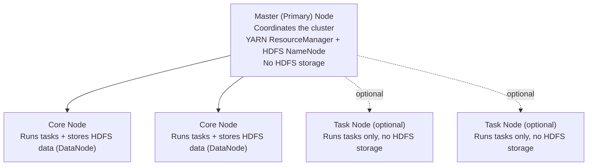
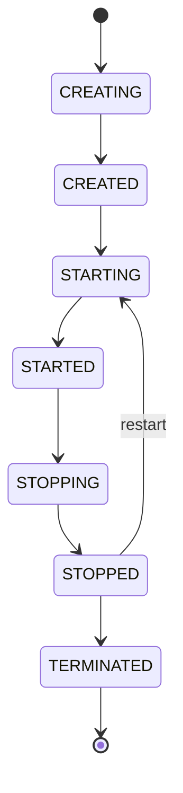

# AWS EMR

This lesson covers the README's "AWS EMR" section (lines 759-929). The hands-on build lives in `5.emr-code/`. Note: the README's setup text mentions a `4.emr-code` directory. That directory does not exist in this repo. The correct folder is `5.emr-code`.

## What EMR Is

EMR is a managed cluster platform. It runs big data frameworks for you. You do not install Hadoop or Spark by hand. EMR installs and configures them on a cluster of EC2 instances, on EKS, or in a serverless mode.

## EMR on EC2: Cluster Architecture

An EMR-on-EC2 cluster can have up to three node types. Each node type has a distinct job.

| Node type | Runs tasks | Stores HDFS data | Required? |
|---|---|---|---|
| Master (primary) | Coordinates the cluster | No | Yes, always |
| Core | Yes | Yes | No, but needed for any multi-node cluster |
| Task | Yes | No | No, fully optional |

### Master node

The master node manages the cluster. It runs the YARN ResourceManager and the HDFS NameNode. It tracks the health of other nodes. It distributes work to core and task nodes. It does not usually run the actual data processing tasks itself.

### Core node

A core node runs tasks and stores data in HDFS. The HDFS DataNode process runs on every core node. A multi-node cluster needs at least one core node. Core nodes are the only place cluster data physically lives, aside from data you keep in S3.

### Task node

A task node runs tasks only. It does not store HDFS data. Task nodes are optional. You add them purely for extra compute power when a job needs more parallelism than the core nodes provide.

### Why only the master node is strictly required

A one-node EMR cluster is possible. In that case, the single node acts as master, core, and task at once. Core and task nodes exist to scale out compute and storage beyond what one node offers. They are not required for the cluster to function.

### HDFS and why core nodes store the data

HDFS (Hadoop Distributed File System) splits files into blocks and spreads the blocks across nodes. It replicates each block so that a node failure does not lose data. EMR sets the default replication factor based on cluster size:

- 1 to 3 core+task nodes: replication factor 1 (no redundancy)
- 4 to 9 core+task nodes: replication factor 2
- 10 or more core+task nodes: replication factor 3

Only core nodes run the HDFS DataNode process. Task nodes deliberately do not, because EMR expects task nodes to scale in and out often. Storing HDFS blocks on a node that can disappear at any time would risk data loss and force constant re-replication. Keeping storage on core nodes only, and compute-only capacity on task nodes, cleanly separates "durable state" from "elastic capacity."

### Losing a task node vs. losing a core node

This is a common exam distinction.

**Lose a task node:** Any YARN containers (task attempts) running on it fail. YARN's ApplicationMaster reschedules that work on other available nodes. No data is lost, because no HDFS blocks lived there. This is why task nodes are the standard target for Spot Instances: an interruption only costs you re-computation, never data.

**Lose a core node:** You lose both compute (its running tasks fail and are rescheduled, same as a task node) and one replica of every HDFS block stored on it. If the replication factor is 2 or 3, the data usually still exists on other core nodes, but redundancy drops and HDFS must re-replicate the affected blocks onto remaining nodes to restore the target factor. If you lose enough core nodes at once, or the cluster's replication factor is 1, you can lose data outright. Because of this, EMR treats core node removal more carefully than task node removal, and shrinking the core group is slower and riskier than shrinking the task group. Practical rule: put Spot Instances on task nodes for cost savings; keep core nodes on On-Demand (or use Spot there cautiously) because losing them threatens data, not just compute.

## Transient vs. Persistent Clusters

| | Transient cluster | Persistent (long-running) cluster |
|---|---|---|
| Lifecycle | Created for one job, auto-terminates when steps finish | Stays running for days, weeks, or months |
| Billing | Pay only for the run duration | Pay continuously, including idle time |
| Best fit | Scheduled batch ETL (nightly jobs, one-off transforms) | Interactive/ad hoc work: notebooks, Hive/Presto queries, shared data science use |
| Typical trigger | Orchestrated by Step Functions, a scheduler, or a pipeline | Created once via console/CLI and left running |

The tradeoff is straightforward. Transient clusters minimize cost because you never pay for idle capacity, but they add startup latency to every job (a few minutes to provision). Persistent clusters remove that startup latency and suit unpredictable, ad hoc query patterns, but you pay for every idle hour. EMR exposes an `IsIdle` CloudWatch metric specifically so you can detect an idle persistent cluster and decide whether to shut it down.

## Processing Frameworks and YARN

EMR's core frameworks are **Hadoop MapReduce** and **Apache Spark**. These are the two general-purpose distributed processing engines the exam focuses on most.

EMR also supports several other frameworks, which the tutorial setup in this repo installs: **Hive** (SQL over Hadoop/Spark), **Pig** (a scripting language for data flows, largely legacy), **Presto** and **Trino** (fast distributed SQL query engines), **HBase** (a NoSQL wide-column store on top of HDFS), and **Flink** (stream processing).

**YARN (Yet Another Resource Negotiator)** is the default cluster resource manager. Its job: schedule work and negotiate compute resources (memory, vCPU) among frameworks that share the same cluster. When Spark and Hive both run on one cluster, YARN is what decides how much of the cluster each gets at a given moment, and queues work when demand exceeds capacity.

Exam-relevant nuance: not every framework in the list above runs on YARN. Spark, Hadoop MapReduce, Hive, and Flink are YARN-based. **Presto and HBase are not** — they manage their own resources outside YARN. This matters directly for autoscaling (see below): EMR's automatic scaling reacts to YARN metrics, so it does not see load generated by Presto or HBase.

## Storage: HDFS vs. EMRFS

**HDFS** is local, cluster-attached storage spread across core nodes, as described above. It is fast for local reads/writes and is the natural place for **intermediate shuffle data** during a Spark or MapReduce job — the temporary data exchanged between processing stages. HDFS data lives and dies with the cluster; terminate the cluster and, unless you copied the data elsewhere, it is gone.

**EMRFS** is EMR's connector that lets Hadoop-compatible applications read and write **Amazon S3** as if it were a filesystem. This is what most AWS-native EMR usage relies on, for one core reason: it **decouples storage from compute**. Your data lives durably in S3, independent of any cluster's lifecycle. You can spin up a transient cluster, point it at S3 via EMRFS, run the job, terminate the cluster, and the data is untouched. This is what makes the transient-cluster cost model (above) actually workable — if data lived only in HDFS, you could never safely terminate a cluster.

**When to still reach for HDFS:** performance-sensitive intermediate data within a single job run (shuffle, spill, checkpoints), and any workload where you need fast local disk I/O rather than network calls to S3. In practice, a well-designed EMR job reads raw input from S3 (EMRFS), uses HDFS for its own intermediate/shuffle data during processing, and writes final output back to S3 (EMRFS).

Historical footnote, not usually exam-critical today: EMRFS once needed an optional "consistent view" feature (backed by DynamoDB) to work around S3's old eventual-consistency behavior. S3 has been strongly consistent since December 2020, so this workaround is largely legacy.

## EMR Serverless

EMR Serverless removes cluster and instance management entirely. Operationally, this is the key difference from EMR on EC2:

| | EMR on EC2 | EMR Serverless |
|---|---|---|
| You provision | Master/core/task EC2 instances | Nothing — no instances, no cluster sizing |
| You choose | Instance types, node counts, scaling policy | An EMR release version + a runtime type |
| Billing | Per instance-hour, cluster running or idle | Per vCPU/memory-second actually consumed by a job |

You pick a release version and a runtime environment. **Correction to the README:** the README states the runtime choices are "Hive, Spark, Presto." As of current AWS documentation, EMR Serverless supports only two application types: **Spark and Hive**. Presto/Trino is not an EMR Serverless application type — it runs on EMR on EC2 or, separately, as Amazon Athena. Do not repeat "Presto" as an EMR Serverless option on the exam.

### Application lifecycle states (verified against AWS docs)

An EMR Serverless application moves through these states:

- **CREATING** — application is being set up, not yet usable
- **CREATED** — exists, but has not provisioned any capacity yet
- **STARTING** — provisioning capacity
- **STARTED** — ready to accept job runs (jobs only get accepted in this state)
- **STOPPING** — jobs have finished, capacity is being released
- **STOPPED** — no resources running; can be restarted or reconfigured
- **TERMINATED** — permanently deleted, no longer listed

The README's diagram is consistent with this list; it just does not name every intermediate state. The important exam point: **you are billed for the resources an application holds while STARTED (and while jobs run on it)**. Because an application can sit idle in the STARTED state without auto-stopping (unless you configure auto-stop), you must explicitly stop or terminate it to guarantee billing stops — the same idle-cost trap as a persistent EMR-on-EC2 cluster, just at the application level instead of the cluster level.

## EMR on EKS

EMR on EKS runs EMR workloads on an **existing Amazon EKS (Kubernetes) cluster**, instead of EMR provisioning and managing its own EC2 instances. You register a "virtual cluster" that maps to a Kubernetes namespace, and job runs execute as pods inside that namespace. Compute can be backed by EC2 or Fargate.

Unlike EMR on EC2, which runs many frameworks side by side, EMR on EKS is primarily built around **Apache Spark** (jobs submitted via the EMR API, `spark-submit`, or the Spark Operator).

**When EMR on EKS makes sense:** your organization has already standardized on Kubernetes/EKS as its compute platform for other workloads, and you want big data jobs to share that same cluster capacity, namespace isolation, and operational tooling (monitoring, RBAC, CI/CD) rather than running a separate EMR-managed fleet. It is a good fit when platform teams want one shared Kubernetes control plane across many teams and workload types (web services, batch jobs, ML, Spark), instead of maintaining EMR-on-EC2 clusters as a separate operational silo.

**When it does not make sense:** if you have no existing EKS investment, plain EMR on EC2 or EMR Serverless is simpler — you are not gaining anything by adding Kubernetes as a dependency.

## Three-Way Comparison: EMR on EC2 vs. EMR Serverless vs. EMR on EKS

| | EMR on EC2 | EMR Serverless | EMR on EKS |
|---|---|---|---|
| Who manages infrastructure | You (instance types, cluster sizing, scaling policy) | AWS (no instances or cluster to manage) | You/your platform team manage the EKS cluster; EMR manages the job containers within it |
| Billing granularity | Per EC2 instance-hour, whole cluster (running or idle) | Per vCPU/memory-second actually used by jobs | Per underlying EKS compute (EC2 or Fargate) actually used by job pods |
| Typical use case | Full framework flexibility (Hadoop, Spark, Hive, Presto, HBase, Flink); fine-grained cluster tuning | Spark/Hive jobs where you don't want to think about cluster sizing at all | Spark workloads on a shared, already-existing Kubernetes platform |
| Operational control | Highest — you tune instance types, node counts, bootstrap actions, scaling rules | Lowest — AWS handles provisioning and scaling within your resource limits | High for Kubernetes-native teams — Kubernetes-style operations (namespaces, RBAC), but Spark-focused |

Exam framing: this is a "who manages what, and what do you pay for" question. EC2 = most control, most operational responsibility. Serverless = least operational overhead, pay-per-use, narrower framework choice (Spark/Hive only). EKS = you bring your own cluster (Kubernetes), EMR brings the big-data job execution on top of it.

## Security

At a conceptual level, for the exam:

- **Encryption at rest and in transit** is supported for EMR, covering both data on cluster storage (HDFS, local disks) and data moving between nodes or to/from S3.
- **AWS Lake Formation** and **Apache Ranger** both provide fine-grained access control (column/row/table-level permissions) layered on top of plain IAM, which alone only controls access at the resource level (e.g., "can call this API," "can read this S3 bucket"), not inside a dataset.
- **Network security** is enforced the usual VPC way: security groups control inbound/outbound traffic at the instance level, and NACLs control traffic at the subnet level.

This lesson treats security only at this conceptual level, matching how briefly the README covers it. Do not treat this as a full security design — verify actual controls with a security owner before applying them to a real workload.

## Orchestration and Automation

### EMR Steps

A **step** is a unit of work submitted to a running cluster (or to a transient cluster at creation time) — for example, "run this Spark job." The tutorial adds a step using **`command-runner.jar`**, a generic wrapper that lets a step run an arbitrary shell command (here, `spark-submit ...`) instead of requiring a purpose-built step type for every tool. This is how you turn "SSH in and run spark-submit by hand" into something you can automate and re-run without a person present.

### Step Functions for EMR orchestration

The tutorial uses **AWS Step Functions** to create the cluster, submit steps, and terminate the cluster, driven by a JSON state machine definition. Step Functions is a natural fit here for the same reasons covered in the Step Functions vs. EventBridge vs. Glue Workflows vs. MWAA comparison from the Glue lesson, applied to EMR instead of Glue:

- Step Functions has direct, built-in service integrations for the EMR API (create cluster, add steps, terminate cluster), including a "run and wait for completion" pattern, with native retry/catch error handling — no custom glue code needed.
- EventBridge is event-driven/reactive (react to a state change), not a sequence orchestrator — it is a poor fit for "do A, then B, then C, then clean up."
- Glue Workflows are scoped to Glue's own components (crawlers, Glue jobs, triggers) — not EMR.
- MWAA (managed Airflow) fits complex, code-heavy, cross-system DAGs with rich branching logic, but carries a bigger operational footprint (its own environment to run) than a serverless Step Functions state machine needs for a straightforward create-cluster-run-steps-terminate sequence.

For a scheduled, transient EMR job, Step Functions gives you the orchestration with the least operational overhead.

### Autoscaling — correction on metric naming

The tutorial's autoscaling walkthrough sets a **custom scaling policy** using a metric called `AppsRunning`, with a threshold (`>= 2` to scale out, `< 2` to scale in), an evaluation period (one five-minute period), and a cooldown (60 seconds). I verified this against current AWS documentation, and it needs one clarification, not a correction of fact:

**`AppsRunning` is a real, valid EMR CloudWatch metric** (namespace `AWS/ElasticMapReduce`) — it counts YARN applications currently running. So the README's tutorial is technically accurate, not fabricated.

However, EMR actually has **two distinct scaling features**, and the exam is more likely to test the newer one:

1. **Automatic scaling with a custom policy** (the older feature, and what this tutorial uses) — you manually pick a CloudWatch metric (`AppsRunning`, `ContainerPendingRatio`, `YARNMemoryAvailablePercentage`, etc.), a comparison operator, a threshold, an evaluation period, and a cooldown, for scale-out and scale-in separately. Only works with instance groups, not instance fleets.
2. **EMR Managed Scaling** (the newer, AWS-recommended feature) — you set only a minimum and maximum cluster capacity. EMR's own internal algorithm decides when and how much to scale, using metrics like `YARNMemoryAvailablePercentage`, `ContainerPendingRatio`, and `HDFSUtilization` under the hood — you never pick a metric or threshold yourself. Works with both instance groups and instance fleets.

The README's tutorial demonstrates option 1. Current AWS guidance and most current exam material lean toward option 2 (Managed Scaling) as the recommended, lower-effort approach. Know both exist, know Managed Scaling is the "just set min/max and let EMR handle it" answer, and know that autoscaling driven by YARN metrics only reacts to YARN-based frameworks (Spark, Hadoop, Hive, Flink) — not Presto or HBase, which don't run on YARN.

## AWS Glue Data Catalog as EMR's Metastore

The README notes that EMR can use the **AWS Glue Data Catalog** as its Hive-compatible metastore (the tutorial setup explicitly selects "Use for Hive table metadata" and "Use for Spark table metadata" when creating the cluster). This is the same Glue Data Catalog covered in your Glue lesson: one central, serverless, managed metastore that Hive, Spark, Presto/Trino, Athena, and Glue jobs can all share, instead of each engine keeping its own separate metastore. Using it with EMR means table definitions created by a Glue job or crawler are immediately visible to Hive/Spark on your EMR cluster, and vice versa, without any manual syncing.

## Other README Simplifications Worth Flagging

- The setup instructions reference a `4.emr-code` directory that does not exist in this repo (the real folder is `5.emr-code`). This is a repo navigation issue, not an EMR concept issue, but it will mislead you if you go looking for the CloudFormation script by that name.
- The README's one-line definitions of master/core/task nodes are correct but minimal — they do not explain the consequence of losing each node type, which is exactly the kind of "what happens if" reasoning the exam tests. See the dedicated subsection above.
- The README states EMR Serverless's runtime choices as "Hive, Spark, Presto" — Presto is not a supported EMR Serverless application type. Corrected above.
- The README's autoscaling section teaches the older custom-policy mechanism without mentioning EMR Managed Scaling exists as a separate, newer, generally-preferred feature. Both are covered above.

## Exam Checklist

- Master node: always required, coordinates the cluster, runs ResourceManager + NameNode. Core node: runs tasks and stores HDFS data (DataNode); at least one needed for a multi-node cluster. Task node: runs tasks only, stores no data, fully optional.
- Losing a task node costs you re-computation only. Losing a core node costs you re-computation plus a replica of every HDFS block it held — put Spot Instances on task nodes, not core nodes.
- HDFS default replication: 1 (< 4 core+task nodes), 2 (4-9 nodes), 3 (10+ nodes).
- Transient cluster = pay only for job duration, best for scheduled batch ETL. Persistent cluster = always-on, best for interactive/ad hoc work, but you pay for idle time (watch the `IsIdle` metric).
- YARN is EMR's default resource manager, scheduling and sharing resources across frameworks on one cluster. Spark, Hadoop MapReduce, Hive, and Flink run on YARN. Presto and HBase do not.
- EMRFS (S3 as a filesystem) decouples storage from compute and is the standard AWS-native choice — data survives cluster termination. HDFS is still useful for fast local/intermediate shuffle data during a job.
- EMR Serverless: no instances to size, choose a release version + runtime (Spark or Hive only — not Presto), billed per resource-second used. Application states: CREATING → CREATED → STARTING → STARTED → STOPPING → STOPPED, or TERMINATED. Billing only truly stops once you stop/terminate — an idle STARTED application still costs money.
- EMR on EKS: runs (mainly Spark) EMR workloads on an existing EKS cluster via a virtual cluster mapped to a namespace. Best when you're already standardized on Kubernetes and want to share cluster capacity across teams/workloads.
- Three-way comparison: EC2 = most control/most management; Serverless = least management, pay-per-use, narrowest framework choice; EKS = you own the Kubernetes layer, EMR runs jobs on top.
- Fine-grained access control on EMR data comes from Lake Formation or Apache Ranger, layered on top of IAM (IAM alone is resource-level, not row/column-level).
- EMR Steps + `command-runner.jar` let you automate arbitrary shell commands (like `spark-submit`) as a trackable, re-runnable unit of work.
- Step Functions is the natural orchestrator for create-cluster → submit-steps → terminate-cluster because of its native EMR API integrations and built-in retry/wait semantics — same logic as the Glue orchestration comparison, applied to EMR.
- Two separate EMR scaling features exist: custom scaling policy (you pick the metric, e.g. `AppsRunning`, `ContainerPendingRatio`, `YARNMemoryAvailablePercentage`) vs. EMR Managed Scaling (you set min/max only, EMR decides internally). Expect the exam to favor Managed Scaling as the recommended approach.
- The Glue Data Catalog can serve as EMR's Hive-compatible metastore, shared across Hive, Spark, Presto/Trino, Athena, and Glue jobs.

## Practice Questions

### Q1

A media analytics company runs a persistent EMR cluster with 1 master node, 6 core nodes, and 10 task nodes. The cluster caches datasets and stores Spark shuffle data directly in HDFS across the core nodes. A data engineer wants to cut compute cost by moving as many nodes as possible onto EC2 Spot Instances. Leadership has approved the cost optimization but will not accept any chance of losing cluster-stored data or destabilizing HDFS.

Which change should the data engineer make?

- A. Move all core and task nodes to Spot Instances to maximize savings.
- B. Move only the task nodes to Spot Instances, and keep the core nodes on On-Demand Instances.
- C. Move only the core nodes to Spot Instances, and keep the task nodes on On-Demand Instances.
- D. Move the master node to Spot Instances, since it does not store HDFS data.

**Answer: B**

Task nodes run compute only and never store HDFS blocks, so a Spot interruption on a task node only costs re-computation — YARN reschedules the lost work and no data is lost. Core nodes store HDFS blocks, so interrupting them risks losing a replica of that data (and forces re-replication); keeping them on On-Demand protects durability. A puts the core nodes at risk. C is backwards — it protects the wrong node type. D is wrong for a different reason: the master node coordinates the entire cluster (ResourceManager, NameNode), so losing it risks taking down the whole cluster, not just one replica of data — it is the last node type you would ever put on Spot.

### Q2

A retail company runs a nightly batch job that transforms the previous day's sales data. The job takes about 40 minutes and runs once every 24 hours. No one queries or needs cluster capacity outside that nightly window. The finance team has asked the data engineering team to minimize idle compute cost while still meeting the nightly processing SLA.

Which cluster strategy should the data engineer implement?

- A. Launch a persistent EMR cluster once, and leave it running continuously so the nightly job always has warm capacity.
- B. Launch a transient EMR cluster each night through an orchestration tool, run the ETL steps, and let the cluster auto-terminate when the steps finish.
- C. Launch a persistent cluster and manually stop the underlying EC2 instances outside the nightly window.
- D. Launch a persistent cluster and rely on the `IsIdle` CloudWatch metric to alert the team so someone can manually terminate the cluster after each nightly run.

**Answer: B**

This is exactly the transient-cluster use case: a scheduled, one-off batch job with a clear start and end. Pay only for the ~40 minutes the job runs, and the cluster auto-terminates — no idle cost, no manual cleanup. A pays for roughly 23 idle hours every day. D turns the `IsIdle` metric (a tool for noticing an idle persistent cluster) into a manual daily chore, which still leaves cluster management overhead and does not minimize cost as directly as a transient cluster. C is not a standard, supported way to pause an active EMR cluster's billing and still leaves cluster infrastructure provisioned.

### Q3

A data engineering team runs a single persistent EMR cluster that serves two workloads at once: a scheduled Spark ETL pipeline, and an ad hoc Presto SQL layer that analysts query throughout the business day. To handle bursts of Presto traffic, the team configured EMR automatic scaling with a custom policy that scales the core instance group out whenever the `AppsRunning` metric reaches a threshold. During a period of heavy Presto query load, cluster performance degrades noticeably, yet the `AppsRunning` alarm never breaches and EMR never scales out.

What is the most likely explanation?

- A. `AppsRunning` is not a valid CloudWatch metric for EMR, so the scaling policy silently fails.
- B. Presto does not run on YARN, so a YARN-based metric like `AppsRunning` never reflects Presto's load.
- C. Custom scaling policies only work with instance fleets, and this cluster uses instance groups.
- D. EMR Managed Scaling must be enabled before any custom metric-based scaling policy can take effect.

**Answer: B**

`AppsRunning` counts YARN applications. Presto manages its own resources outside YARN, so Presto query load never shows up as a YARN application and never moves this metric — the cluster genuinely looks idle to the scaling policy even while Presto is under heavy load. A is false: `AppsRunning` is a real EMR CloudWatch metric (namespace `AWS/ElasticMapReduce`). C reverses the actual rule — custom scaling policies work only with instance groups, not instance fleets, so a cluster using instance groups is exactly where a custom policy is expected to apply. D is invented; Managed Scaling and custom scaling policies are two independent, mutually exclusive mechanisms, not a prerequisite chain.

### Q4

A data engineer is designing a transient EMR Spark job. It reads a 500 GB raw dataset, performs wide transformations (joins and aggregations) that shuffle data between stages, and writes final aggregated output for other teams to consume. The cluster terminates automatically once the job finishes. The data engineer must decide, separately, where the input, the shuffle/intermediate data, and the final output should each live during the run.

Which storage design meets the durability requirement while preserving good shuffle performance?

- A. Read input from S3 via EMRFS, use HDFS on the core nodes for shuffle/intermediate data, and write final output back to S3 via EMRFS.
- B. Read input from HDFS, shuffle in HDFS, and write final output to HDFS.
- C. Read input from S3 via EMRFS, shuffle in S3 via EMRFS, and write final output to S3 via EMRFS.
- D. Read input from HDFS, shuffle in S3 via EMRFS, and write final output to HDFS.

**Answer: A**

This is the standard well-designed EMR pattern: EMRFS (S3) for durable input and output because the data must survive the cluster's termination, and HDFS for intermediate shuffle data because it is fast local disk I/O rather than network calls to S3. B loses the final output the moment the transient cluster terminates, since HDFS data lives and dies with the cluster. C is durable end-to-end but pays a network-I/O performance penalty for every shuffle write/read, which HDFS is specifically better suited for. D is an inconsistent mix that still loses the final output on termination and gains nothing from routing shuffle traffic through S3.

### Q5 (Choose TWO)

A startup wants to run occasional Spark ETL jobs without maintaining any persistent infrastructure. Jobs run a few times a day, each taking 10-20 minutes, and workload volume is unpredictable. The team wants to pay only for compute actually consumed during job execution, and does not want to choose EC2 instance types, size a cluster, or define a scaling policy. They are evaluating EMR Serverless.

Which two statements about EMR Serverless are correct? (Choose TWO.)

- A. EMR Serverless supports Spark and Hive as application (runtime) types.
- B. EMR Serverless supports Spark, Hive, and Presto as application (runtime) types.
- C. An EMR Serverless application left in the STARTED state with no auto-stop configured continues to incur charges even when no job is currently running.
- D. Job runs are billed only while the application is in the CREATED state.
- E. EMR Serverless requires the data engineer to select EC2 instance types for its worker capacity.

**Answer: A, C**

EMR Serverless supports exactly two application types: Spark and Hive — not Presto, which runs on EMR on EC2 or separately as Athena (B is wrong). An application can sit in the STARTED state indefinitely without auto-stopping; you are billed for the resources it holds while STARTED, so an idle STARTED application still costs money until it is explicitly stopped or terminated (C is correct). D is wrong: CREATED means the application exists but has not provisioned any capacity yet, so nothing is billed there — billing happens once the application is STARTED and jobs run. E is wrong: not choosing instance types is the entire point of EMR Serverless — you pick only a release version and a runtime type.

### Q6

A large enterprise already runs hundreds of microservices and machine learning batch jobs on a shared Amazon EKS cluster. Platform engineering requires new workloads to run inside this same Kubernetes environment so they inherit consistent namespace isolation, RBAC, and monitoring tooling. A data engineering team now needs to add Spark-based ETL jobs, and wants those jobs to share the existing cluster's capacity and operational tooling rather than stand up a separate EMR-managed fleet of EC2 instances.

Which EMR deployment option should the team choose?

- A. EMR on EC2 with a persistent cluster
- B. EMR on EC2 with a transient cluster orchestrated by Step Functions
- C. EMR Serverless
- D. EMR on EKS

**Answer: D**

EMR on EKS runs EMR workloads — primarily Spark — on an existing EKS cluster through a virtual cluster mapped to a Kubernetes namespace. It is the option built for exactly this situation: an organization already standardized on Kubernetes that wants big-data jobs to share the same cluster capacity, namespace isolation, and operational tooling instead of running EMR as a separate silo. A and B both provision a wholly separate EMR-managed EC2 fleet, which is precisely what the team wants to avoid. C provisions AWS-managed serverless capacity with no relationship at all to the company's existing EKS namespaces or RBAC model.

### Q7

A data engineering team is choosing an EMR deployment model for a new workload. Requirements: (1) run Spark, Hive, and HBase together on one cluster, with fine-grained control over instance types and bootstrap actions; (2) the team has deep in-house Hadoop administration expertise and wants to tune configuration at the OS/JVM level when needed; (3) the organization does not use Kubernetes anywhere today.

Which EMR deployment option best satisfies these requirements?

- A. EMR Serverless
- B. EMR on EKS
- C. EMR on EC2
- D. AWS Glue with a custom connector for HBase

**Answer: C**

Only EMR on EC2 offers full framework flexibility — Hadoop, Spark, Hive, Presto, HBase, Flink all on one cluster — plus the highest degree of operational control: instance types, node counts, bootstrap actions, and scaling rules are all tunable. EMR Serverless supports only Spark and Hive as application types, has no HBase support, and deliberately removes instance/infrastructure-level tuning — the opposite of requirement (2). EMR on EKS needs an existing Kubernetes investment the organization doesn't have, and it is primarily built around Spark, not HBase. AWS Glue is a serverless ETL service; it does not run HBase workloads at all.

### Q8 (Choose TWO)

A data engineering team needs a fully automated nightly pipeline: create a transient EMR cluster, run a sequence of Spark and Hive steps against data in S3, and terminate the cluster once the steps finish. Table definitions created by the Hive step must be immediately visible to Athena and to the team's existing Glue ETL jobs, with no manual metadata synchronization. The team also wants an orchestration approach with native, built-in EMR API integration (create cluster, add step, wait for completion, terminate) and minimal custom code.

Which two actions should the data engineer take to meet these requirements? (Choose TWO.)

- A. Orchestrate the pipeline using AWS Step Functions with its built-in EMR service integrations.
- B. Orchestrate the pipeline using Amazon EventBridge rules that react to cluster state changes.
- C. Configure the EMR cluster to use the AWS Glue Data Catalog for Hive and Spark table metadata.
- D. Configure the EMR cluster to run its own dedicated Hive metastore on an Amazon RDS instance.
- E. Orchestrate the pipeline using AWS Glue Workflows.

**Answer: A, C**

Step Functions has direct, built-in service integrations for the EMR API — create cluster, add steps, wait for completion, terminate cluster — with native retry/catch handling and no custom glue code, making it the natural fit for a create-run-terminate sequence. Pointing the cluster's Hive and Spark table metadata at the Glue Data Catalog gives one shared metastore that Athena and Glue jobs already read from, so new tables appear everywhere without manual syncing. B is wrong: EventBridge is event-driven/reactive, not a sequence orchestrator, and is a poor fit for "do A, then B, then C, then clean up." D technically stores metadata, but a dedicated RDS-backed Hive metastore is not automatically visible to Athena or Glue jobs — it requires separate integration work, which contradicts the "no manual synchronization" requirement. E is wrong: Glue Workflows orchestrate Glue's own components (crawlers, Glue jobs, triggers), not EMR clusters or steps.
